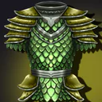
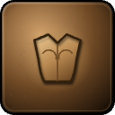
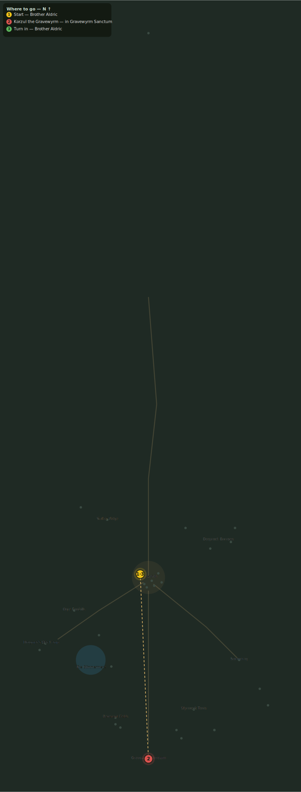

# Korzul the Gravewyrm

> Quest ID: `q_gravewyrm` · Zone 3 — Thornpeak Heights

| | |
|---|---|
| **Recommended level** | 18+ |
| **Quest giver** | **Brother Aldric**, Priest of the Vale _(at ~x:-10, z:656)_ |
| **Turn in to** | **Brother Aldric**, Priest of the Vale _(at ~x:-10, z:656)_ |
| **Requires** | The Sanctum Gate (`q_sanctum_gate`) |
| **Group quest** | 👥 Suggested players: 5 |

## Story

> There is no rite left to stop, <your name> — only the Wyrm itself, half-woken in its hollow, gorged on the dead of the Vale and the fen. If it rises, the wall, the marsh, Eastbrook — everything we have defended falls in a single night. Take your companions into the Wyrm's Hollow and finish what we began in a chapel yard so long ago. The Light has carried you this far; carry it the rest of the way.

## How to complete

- **Kill 1× [Korzul the Gravewyrm](bestiary.md#mob-korzul_the_gravewyrm)** (level 20–20, **Boss**, **Elite**)
  - Inside dungeon [**Gravewyrm Sanctum**](../../../dungeons/gravewyrm_sanctum.md) (entrance portal ~x:0, z:880)
  - _Tracker: Korzul the Gravewyrm slain_

Then return to **Brother Aldric**, Priest of the Vale _(at ~x:-10, z:656)_ to turn in.

## Rewards

- **XP:** 5300
- **Money:** 25000 copper
- **Item reward (by class):**
  -  🔵 Gravewyrm Scale Hauberk — _warrior_ · 230 armor, +5 Str, +8 Sta
  -  🔵 Wyrmcult Grand Robe — _mage_ · 75 armor, +9 Int, +4 Spi
  -  🔵 Wyrmscale Jerkin — _rogue_ · 145 armor, +9 Agi, +4 Sta

## On completion

> It is over. The dead of three lands may rest, the mountain sleeps unhaunted — and it is your name, $N, that every bell from here to Eastbrook rings tonight.

## Where to go

**[🧭 Open this route in 3D →](#/questroute/q_gravewyrm)**

_Numbered route: ① start → objectives → 3 turn in. Faint dots are the rest of the zone for context — see the [full zone map](README.md). Mob names above link to the [bestiary](bestiary.md)._
