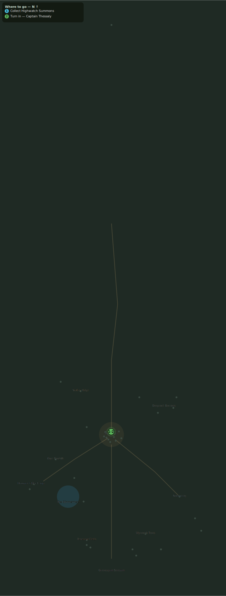

# The Watch on the Peaks

> Quest ID: `q_highwatch_summons` · Zone 3 — Thornpeak Heights

| | |
|---|---|
| **Recommended level** | 12+ |
| **Quest giver** | **Brother Aldric**, Priest of the Vale _(at ~x:-8, z:296)_ |
| **Turn in to** | **Captain Thessaly**, Highwatch Captain _(at ~x:4, z:664)_ |

## Story

> Vael's last words have not left me, <your name>: the Wyrm stirs beneath the peaks. Captain Thessaly commands the wall at Highwatch, at the head of the mountain road north. A summons stands posted at her gate — take it up, and tell her Brother Aldric is climbing the mountain behind you.

## How to complete

- **Collect 1× Highwatch Summons**
  - Pick up from the ground (sparkle objects) at: ~x:1, z:654 · ~x:-2, z:657
  - _Tracker: Highwatch Summons_

Then return to **Captain Thessaly**, Highwatch Captain _(at ~x:4, z:664)_ to turn in.

## Rewards

- **XP:** 500
- **Money:** 500 copper

## On completion

> Aldric's word reaches far. If the priest of the Vale is climbing the mountain himself, then it is as bad as I feared. Welcome to Highwatch, $N.

## Where to go

_Numbered route: ① start → objectives → 3 turn in. Faint dots are the rest of the zone for context — see the [full zone map](README.md). Mob names above link to the [bestiary](bestiary.md)._
