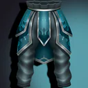
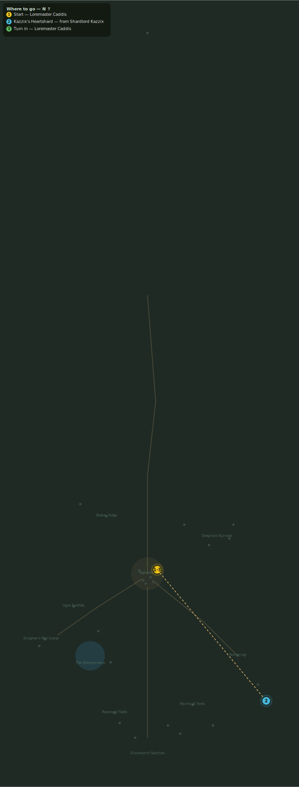

# The Shardlord

> Quest ID: `q_kazzix` · Zone 3 — Thornpeak Heights

| | |
|---|---|
| **Recommended level** | 17+ |
| **Quest giver** | **Loremaster Caddis**, Loremaster _(at ~x:12, z:655)_ |
| **Turn in to** | **Loremaster Caddis**, Loremaster _(at ~x:12, z:655)_ |

## Story

> Among the elementals one burns brighter than the rest: Shardlord Kazzix, a storm given shoulders. Its heartshard would anchor every reading I have taken — if you can wrench it from the thing. It walks the far crags west of Stormcrag, beyond the second camp.

## How to complete

- **Collect 1× Kazzix's Heartshard**
  - Drops from [**Shardlord Kazzix**](bestiary.md#mob-shardlord_kazzix) (100% chance) — Found in the open world at ~x:145, z:815 (1 mob, radius 8)
  - _Tracker: Kazzix's Heartshard_

Then return to **Loremaster Caddis**, Loremaster _(at ~x:12, z:655)_ to turn in.

## Rewards

- **XP:** 3800
- **Money:** 2000 copper
- **Item reward (by class):**
  -  🔵 Stormshard Leggings — _warrior, mage, rogue_ · 110 armor, +5 Sta

## On completion

> The heartshard! Still crackling — magnificent. Take these leggings; I sized them off a guess and a prayer.

## Where to go

**[🧭 Open this route in 3D →](#/questroute/q_kazzix)**

_Numbered route: ① start → objectives → 3 turn in. Faint dots are the rest of the zone for context — see the [full zone map](README.md). Mob names above link to the [bestiary](bestiary.md)._
