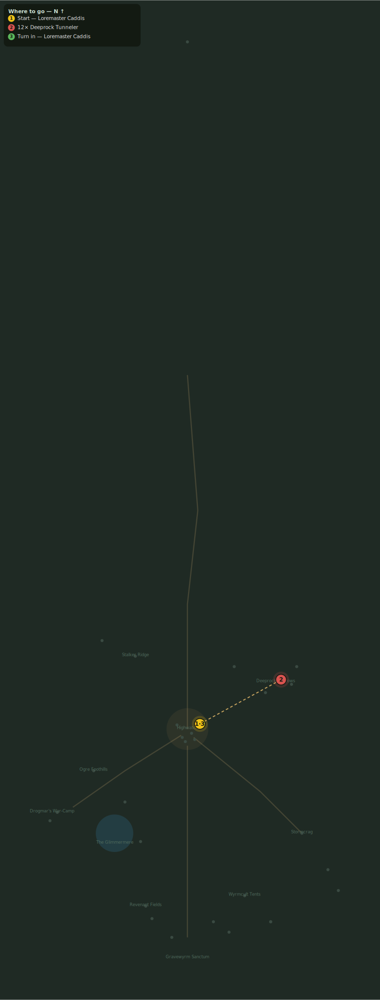

# Deeprock Trouble

> Quest ID: `q_kobold_tunnels` · Zone 3 — Thornpeak Heights

| | |
|---|---|
| **Recommended level** | 14+ |
| **Quest giver** | **Loremaster Caddis**, Loremaster _(at ~x:12, z:655)_ |
| **Turn in to** | **Loremaster Caddis**, Loremaster _(at ~x:12, z:655)_ |

## Story

> The kobolds at Deeprock Burrows are digging deeper than any candle-rat has business digging — straight down, as if something were calling them. Their tunnels run beneath our wall, <your name>. Collapse the matter: kill twelve Deeprock Tunnelers.

## How to complete

- **Kill 12× [Deeprock Tunneler](bestiary.md#mob-deeprock_kobold)** (level 14–15)
  - Found in the open world at ~x:75, z:625 (8 mobs, radius 18)
  - Found in the open world at ~x:105, z:600 (6 mobs, radius 14)
  - _Tracker: Deeprock Tunneler slain_

Then return to **Loremaster Caddis**, Loremaster _(at ~x:12, z:655)_ to turn in.

## Rewards

- **XP:** 2500
- **Money:** 1200 copper

## On completion

> Straight down, every shaft of it — kobolds do not dig like that on their own. I must consult my books.

## Leads to

- Strange Wax (`q_glowing_wax`)

## Where to go

_Numbered route: ① start → objectives → 3 turn in. Faint dots are the rest of the zone for context — see the [full zone map](README.md). Mob names above link to the [bestiary](bestiary.md)._
