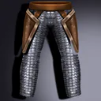
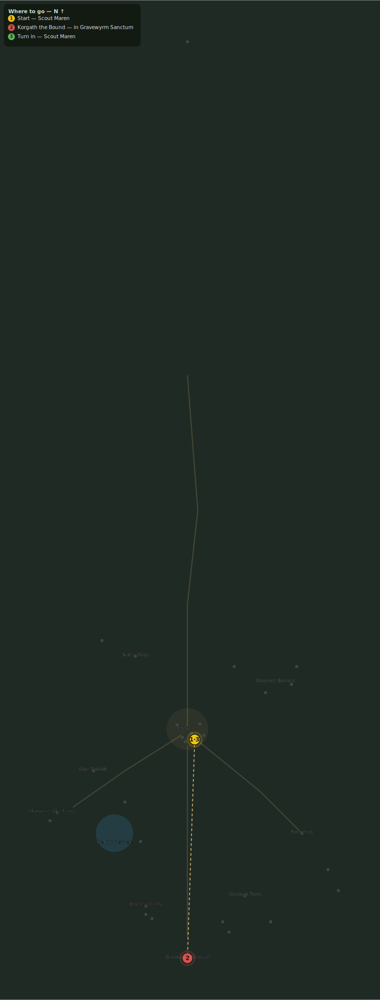

# The Bound Guardian

> Quest ID: `q_korgath` · Zone 3 — Thornpeak Heights

| | |
|---|---|
| **Recommended level** | 18+ |
| **Quest giver** | **Scout Maren**, Marshal's Scout _(at ~x:7, z:670)_ |
| **Turn in to** | **Scout Maren**, Marshal's Scout _(at ~x:7, z:670)_ |
| **Requires** | The Sanctum Gate (`q_sanctum_gate`) |
| **Group quest** | 👥 Suggested players: 5 |

## Story

> My last sweep of the Sanctum's mouth found chains, <your name> — chains thick as a ship's mast, and something ogre-shaped straining inside them. The cult bound a champion at the threshold: Korgath, fed on rage for longer than either of us has been alive. Take four companions and put him down — and when the chains come off, do not let him corner you.

## How to complete

- **Kill 1× [Korgath the Bound](bestiary.md#mob-korgath_the_bound)** (level 20–20, **Elite**)
  - Inside dungeon [**Gravewyrm Sanctum**](../../../dungeons/gravewyrm_sanctum.md) (entrance portal ~x:0, z:880)
  - _Tracker: Korgath the Bound slain_

Then return to **Scout Maren**, Marshal's Scout _(at ~x:7, z:670)_ to turn in.

## Rewards

- **XP:** 4200
- **Money:** 2500 copper
- **Item reward (by class):**
  -  🔵 Korgath's Chainwraps — _warrior, mage, rogue_ · 125 armor, +6 Sta

## On completion

> Korgath, broken at last. Even his chains deserved a kinder end than that. The wraps are yours — wear them past the threshold he kept.

## Where to go

**[🧭 Open this route in 3D →](#/questroute/q_korgath)**

_Numbered route: ① start → objectives → 3 turn in. Faint dots are the rest of the zone for context — see the [full zone map](README.md). Mob names above link to the [bestiary](bestiary.md)._
