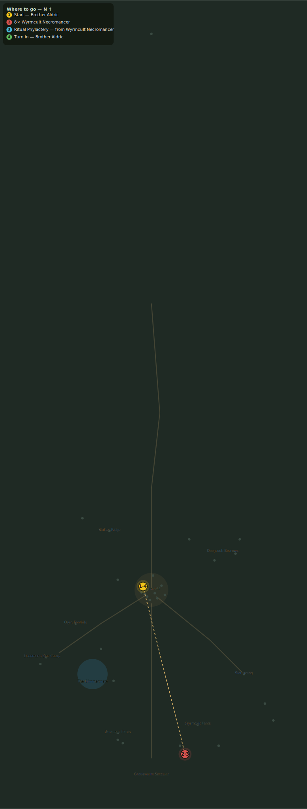

# The Phylactery Ring

> Quest ID: `q_necromancers` · Zone 3 — Thornpeak Heights

| | |
|---|---|
| **Recommended level** | 18+ |
| **Quest giver** | **Brother Aldric**, Priest of the Vale _(at ~x:-10, z:656)_ |
| **Turn in to** | **Brother Aldric**, Priest of the Vale _(at ~x:-10, z:656)_ |
| **Requires** | Orders from Below (`q_cult_orders`) |

## Story

> The orders speak of a "ring of phylacteries" — soul-vessels, <your name>, set about the Sanctum to feed it. The cult's necromancers carry them like holy relics. Kill eight necromancers and bring me three phylacteries unbroken. I must know what souls they hold.

## How to complete

- **Kill 8× [Wyrmcult Necromancer](bestiary.md#mob-wyrmcult_necromancer)** (level 18–19)
  - Found in the open world at ~x:40, z:855 (5 mobs, radius 14)
  - _Tracker: Wyrmcult Necromancer slain_
- **Collect 3× Ritual Phylactery**
  - Drops from [**Wyrmcult Necromancer**](bestiary.md#mob-wyrmcult_necromancer) (55% chance) — Found in the open world at ~x:40, z:855 (5 mobs, radius 14)
  - _Tracker: Ritual Phylactery_

Then return to **Brother Aldric**, Priest of the Vale _(at ~x:-10, z:656)_ to turn in.

## Rewards

- **XP:** 4200
- **Money:** 2200 copper

## On completion

> Light forgive us. These hold the dead of the Vale and the fen — every corpse the Gravecallers ever raised, harvested. They were never building an army, $N. They were gathering a tithe.

## Leads to

- Sigils of the Wyrm (`q_wyrm_sigils`)

## Where to go

**[🧭 Open this route in 3D →](#/questroute/q_necromancers)**

_Numbered route: ① start → objectives → 4 turn in. Faint dots are the rest of the zone for context — see the [full zone map](README.md). Mob names above link to the [bestiary](bestiary.md)._
