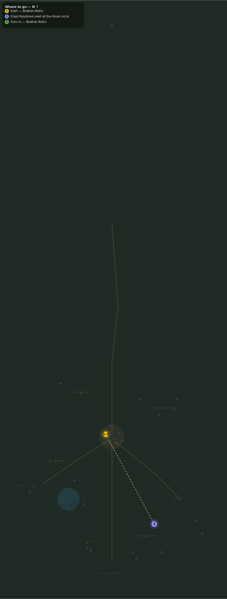

# The Bound Guardian

> Quest ID: `q_nythraxis_bound_guardian` · Zone 3 — Thornpeak Heights

| | |
|---|---|
| **Recommended level** | 20+ |
| **Quest giver** | **Brother Aldric**, Priest of the Vale _(at ~x:-10, z:656)_ |
| **Turn in to** | **Brother Aldric**, Priest of the Vale _(at ~x:-10, z:656)_ |
| **Requires** | The Abandoned Crypt (`q_nythraxis_sealed_crypt`) |
| **Group quest** | 👥 Suggested players: 5 |

## Story

> Voss wrote that the survivors sealed the King's Signet behind an ancient guardian, so no one could reach the tomb of Nythraxis by accident or ambition. Take the Crypt Keystone to the ritual circle on the flat ground north-west of the abandoned crypt and north-east of High Priest Malric's grave. Use it there, break the guardian, and bring back the signet.

## How to complete

- **Interact with Ritual Circle**
  - Locations: ~x:68, z:800
  - _Tracker: Crypt Keystone used at the ritual circle_
- **Kill 1× [The Bound Guardian](bestiary.md#mob-bound_guardian)** (level 20–20, **Boss**, **Elite**)
  - _Spawns as part of a scripted encounter_
  - _Tracker: The Bound Guardian defeated_
- **Collect 1× King's Signet**
  - Drops from [**The Bound Guardian**](bestiary.md#mob-bound_guardian) (100% chance)
  - _Tracker: King's Signet_

Then return to **Brother Aldric**, Priest of the Vale _(at ~x:-10, z:656)_ to turn in.

## Rewards

- **XP:** 5200
- **Money:** 3500 copper
- **Item reward (by class):**
  -  🔵 King's Signet — _warrior, mage, rogue_

## On completion

> The three relics tell the same story: Aldren fought to defend his king, Malric broke the boundary of death, and Voss tried to stop what followed. The seal is weakening, and this signet is the key to Nythraxis's tomb. You are now attuned to enter The Crypt of Nythraxis. Return to the abandoned crypt, unlock the royal door, and face Nythraxis before the old king's rage spills beyond Thornpeak.

## Leads to

- Scourge's End (`q_nythraxis_scourges_end`)

## Where to go

**[🧭 Open this route in 3D →](#/questroute/q_nythraxis_bound_guardian)**

_Numbered route: ① start → objectives → 5 turn in. Faint dots are the rest of the zone for context — see the [full zone map](README.md). Mob names above link to the [bestiary](bestiary.md)._
