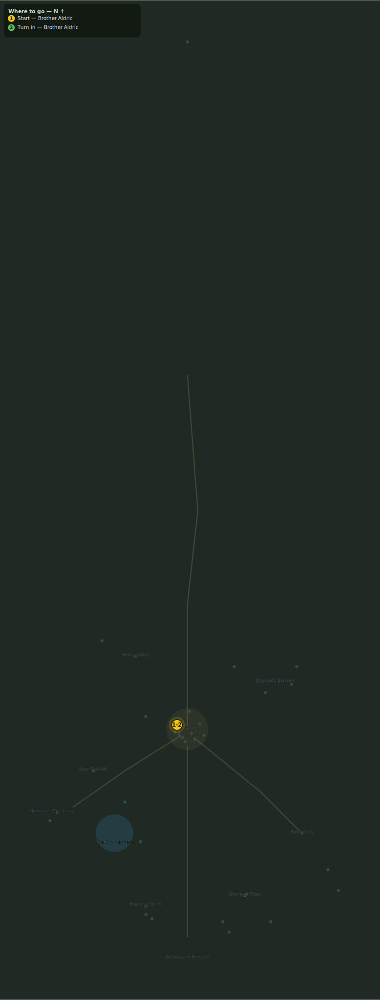

# The Abandoned Crypt

> Quest ID: `q_nythraxis_sealed_crypt` · Zone 3 — Thornpeak Heights

| | |
|---|---|
| **Recommended level** | 20+ |
| **Quest giver** | **Brother Aldric**, Priest of the Vale _(at ~x:-10, z:656)_ |
| **Turn in to** | **Brother Aldric**, Priest of the Vale _(at ~x:-10, z:656)_ |
| **Requires** | Graves of the Forgotten (`q_nythraxis_graves`) |

## Story

> The visions point to the abandoned crypt in the western cliff. There is an old legend that the crypt housed a king. Perhaps Thornpeak sealed him below after Malric's ritual twisted him into something deathless. Enter the crypt and see what remains inside.

## How to complete

- **Collect 1× Crypt Keystone Upper**
  - Drops from **Fallen Captain Aldren** (100% chance)
  - _Tracker: Crypt Keystone Upper_
- **Collect 1× Crypt Keystone Lower**
  - Drops from **Corrupted Priest Malric** (100% chance)
  - _Tracker: Crypt Keystone Lower_
- **Collect 1× Ancient Diary**
  - Drops from **Deathstalker Voss** (100% chance)
  - _Tracker: Ancient Diary_

Then return to **Brother Aldric**, Priest of the Vale _(at ~x:-10, z:656)_ to turn in.

## Rewards

- **XP:** 4600
- **Money:** 2500 copper
- **Item reward (by class):**
  -  🟢 Crypt Keystone — _warrior, mage, rogue_

## On completion

> The keystone halves fit together, and Voss's diary names what they sealed: the signet of King Nythraxis. If the diary is true, that signet is the key to his tomb.

## Leads to

- The Bound Guardian (`q_nythraxis_bound_guardian`)

## Where to go

**[🧭 Open this route in 3D →](#/questroute/q_nythraxis_sealed_crypt)**

_Numbered route: ① start → objectives → 5 turn in. Faint dots are the rest of the zone for context — see the [full zone map](README.md). Mob names above link to the [bestiary](bestiary.md)._
