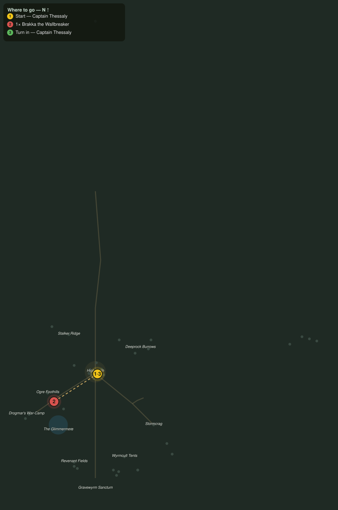

# The Captain's Bounty

> Quest ID: `q_ogre_bounty` · Zone 3 — Thornpeak Heights

| | |
|---|---|
| **Recommended level** | 13+ (zone range 13–20) |
| **Quest giver** | **Captain Thessaly**, Highwatch Captain _(at ~x:4, z:664)_ |
| **Turn in to** | **Captain Thessaly**, Highwatch Captain _(at ~x:4, z:664)_ |
| **Requires** | Totems of War (`q_ogre_totems`) |

## Story

> Maren's totems name the hand that bought the clans: an ogre they call Brakka the Wallbreaker, and he is mustering the rest against my gate. Cut off the head and the clans scatter. Bring me Brakka, <your name>, and Highwatch will pay a captain's bounty.

## How to complete

- **Kill 1× [Brakka the Wallbreaker](bestiary.md#mob-brakka_wallbreaker)** (level 17–17, **Elite**)
  - Found in the open world at ~x:-78, z:716 (1 mob, radius 3)
  - _Tracker: Brakka the Wallbreaker slain_

Then return to **Captain Thessaly**, Highwatch Captain _(at ~x:4, z:664)_ to turn in.

## Rewards

- **XP:** 3000
- **Money:** 1500 copper

## On completion

> Bounty paid in full. The foothills are quieter — now we deal with the ones doing the buying.

## Where to go

**[🧭 Open this route in 3D →](#/questroute/q_ogre_bounty)**

_Numbered route: ① start → objectives → 3 turn in. Faint dots are the rest of the zone for context — see the [full zone map](README.md). Mob names above link to the [bestiary](bestiary.md)._
