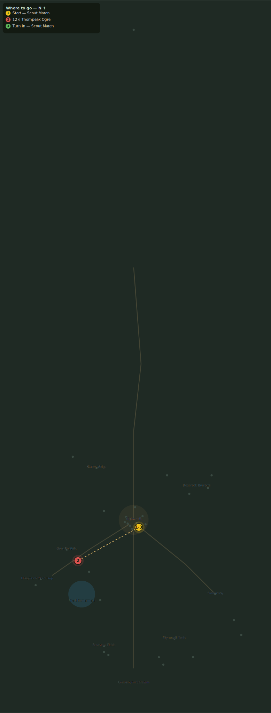

# Ogres at the Foothills

> Quest ID: `q_ogre_edges` · Zone 3 — Thornpeak Heights

| | |
|---|---|
| **Recommended level** | 15+ |
| **Quest giver** | **Scout Maren**, Marshal's Scout _(at ~x:7, z:670)_ |
| **Turn in to** | **Scout Maren**, Marshal's Scout _(at ~x:7, z:670)_ |

## Story

> The Thornpeak clans never come this far east — yet here they are, camped in the eastern foothills with war paint on. Somebody is paying them, <your name>, and ogres do not take promises. Cut twelve of them down while I find out who holds the purse.

## How to complete

- **Kill 12× [Thornpeak Ogre](bestiary.md#mob-thornpeak_ogre)** (level 15–16)
  - Found in the open world at ~x:-90, z:700 (7 mobs, radius 22)
  - Found in the open world at ~x:-60, z:730 (6 mobs, radius 18)
  - _Tracker: Thornpeak Ogre slain_

Then return to **Scout Maren**, Marshal's Scout _(at ~x:7, z:670)_ to turn in.

## Rewards

- **XP:** 2900
- **Money:** 1400 copper

## On completion

> Twelve down, and still they are not pulling back. Whoever bought them paid in something heavier than gold.

## Leads to

- Totems of War (`q_ogre_totems`)

## Where to go

_Numbered route: ① start → objectives → 3 turn in. Faint dots are the rest of the zone for context — see the [full zone map](README.md). Mob names above link to the [bestiary](bestiary.md)._
