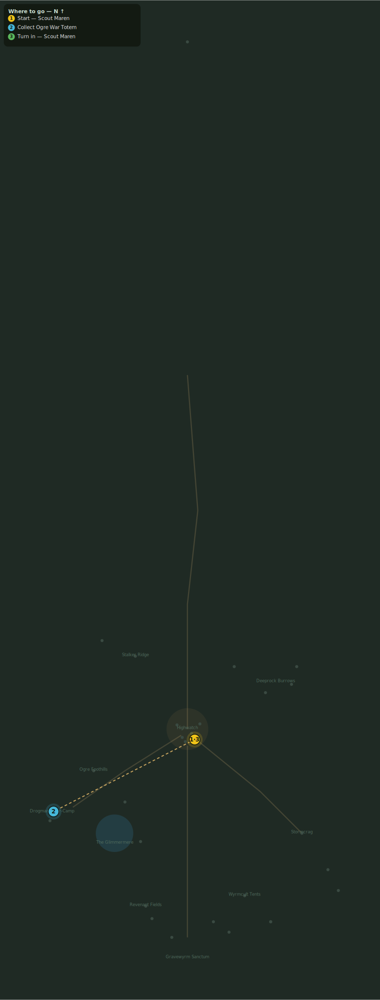

# Totems of War

> Quest ID: `q_ogre_totems` · Zone 3 — Thornpeak Heights

| | |
|---|---|
| **Recommended level** | 13+ (zone range 13–20) |
| **Quest giver** | **Scout Maren**, Marshal's Scout _(at ~x:7, z:670)_ |
| **Turn in to** | **Scout Maren**, Marshal's Scout _(at ~x:7, z:670)_ |
| **Requires** | Ogres at the Foothills (`q_ogre_edges`) |

## Story

> Around the war-camp the ogres have raised totems — crude things of hide and skull, but they mark a muster, not a raid. Tear down six of them and bring them to me. Mind the crushers on the perimeter, <your name>.

## How to complete

- **Collect 6× Ogre War Totem**
  - Pick up from the ground (sparkle objects) at: ~x:-116, z:726 · ~x:-122, z:733 · ~x:-129, z:727 · ~x:-136, z:738 · ~x:-140, z:747 · ~x:-133, z:753 · ~x:-124, z:750
  - _Tracker: Ogre War Totem_

Then return to **Scout Maren**, Marshal's Scout _(at ~x:7, z:670)_ to turn in.

## Rewards

- **XP:** 2800
- **Money:** 1400 copper

## On completion

> Skull, hide... and look here — wyrm-scale bindings. These totems were gifts, $N. The cult is arming the clans.

## Leads to

- The Captain's Bounty (`q_ogre_bounty`)

## Where to go

**[🧭 Open this route in 3D →](#/questroute/q_ogre_totems)**

_Numbered route: ① start → objectives → 3 turn in. Faint dots are the rest of the zone for context — see the [full zone map](README.md). Mob names above link to the [bestiary](bestiary.md)._
