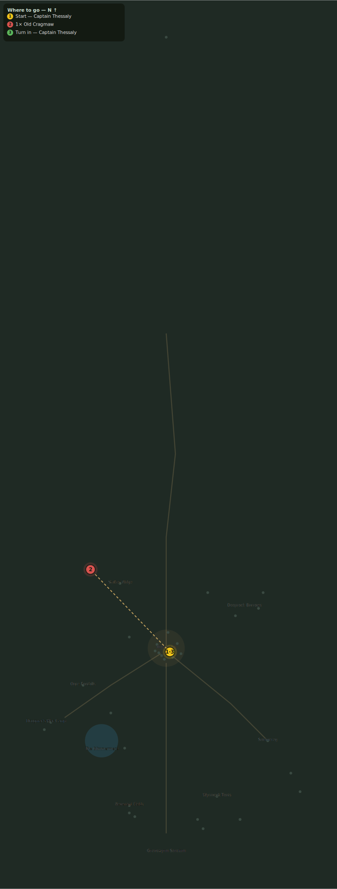

# Old Cragmaw

> Quest ID: `q_old_cragmaw` · Zone 3 — Thornpeak Heights

| | |
|---|---|
| **Recommended level** | 13+ (zone range 13–20) |
| **Quest giver** | **Captain Thessaly**, Highwatch Captain _(at ~x:4, z:664)_ |
| **Turn in to** | **Captain Thessaly**, Highwatch Captain _(at ~x:4, z:664)_ |
| **Requires** | The Stalkers Return (`q_stalkers_return`) |
| **Group quest** | 👥 Suggested players: 2 |

## Story

> The mountain folk put a name to the prints my scout found: Old Cragmaw, a scar-pelted tyrant of a cat that has outlived three generations of its own pack. It is the reason the stalkers flood my road, <your name>. Its den sits on the western ridge above the road south. Bring a friend, and put the old devil down.

## How to complete

- **Kill 1× [Old Cragmaw](bestiary.md#mob-old_cragmaw)** (level 14–14, **Elite**, Rare)
  - Found in the open world at ~x:-82, z:575 (1 mob, radius 5)
  - _Tracker: Old Cragmaw slain_

Then return to **Captain Thessaly**, Highwatch Captain _(at ~x:4, z:664)_ to turn in.

## Rewards

- **XP:** 2700
- **Money:** 1500 copper

## On completion

> Down at last. The mountain folk swore that cat would outlive the wall itself. The stalkers will keep to their high snows now, $N, and my patrols will walk the road without bleeding for it. The whole ridge is quieter for your work.

## Where to go

**[🧭 Open this route in 3D →](#/questroute/q_old_cragmaw)**

_Numbered route: ① start → objectives → 3 turn in. Faint dots are the rest of the zone for context — see the [full zone map](README.md). Mob names above link to the [bestiary](bestiary.md)._
