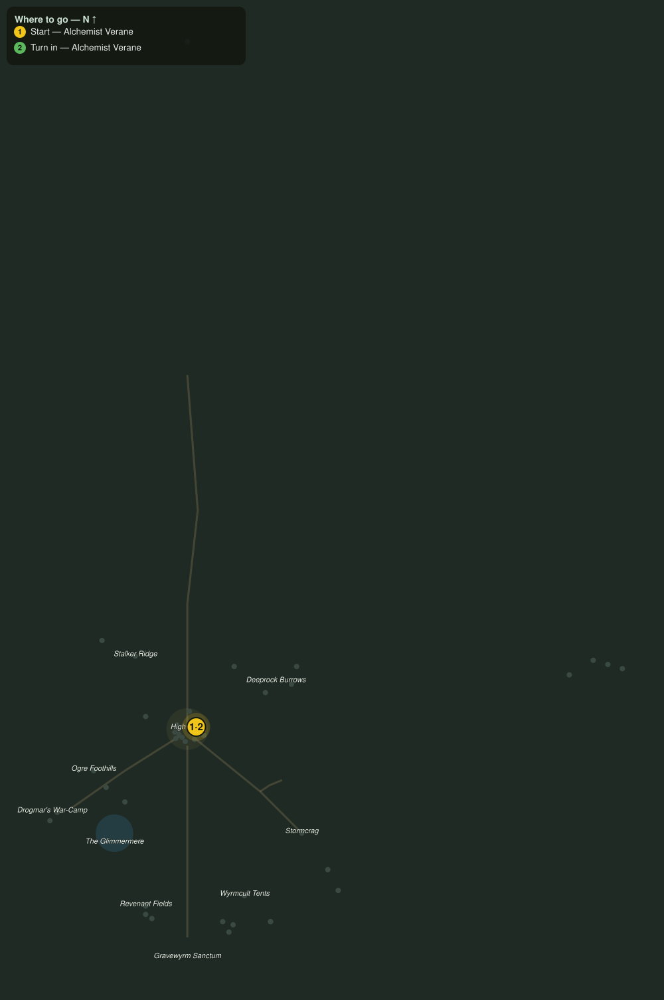

# Apothecary Work Order

> Quest ID: `q_prof_workorder_apothecary` · Zone 3 — Thornpeak Heights

| | |
|---|---|
| **Recommended level** | 13+ (zone range 13–20) |
| **Quest giver** | **Alchemist Verane**, Master of the Apothecary _(at ~x:9, z:658)_ |
| **Turn in to** | **Alchemist Verane**, Master of the Apothecary _(at ~x:9, z:658)_ |

## Story

> My shelves require goldleaf, and the market's stock is, predictably, adulterated. Bring me six goldleaf herbs, unbruised, and you will be compensated precisely. Bruised leaves will be declined, so mind your satchel.

## How to complete

- **Collect 6× Goldleaf Herb**
  - _Granted by a prerequisite quest or special encounter_
  - _Tracker: Goldleaf Herb delivered_

Then return to **Alchemist Verane**, Master of the Apothecary _(at ~x:9, z:658)_ to turn in.

## Rewards

- **XP:** 100
- **Money:** 45 copper

## On completion

> Acceptable. Potent, and properly handled. Your payment, counted to the coin. Do not let it go to your head, that is a different reagent.

## Where to go

**[🧭 Open this route in 3D →](#/questroute/q_prof_workorder_apothecary)**

_Numbered route: ① start → objectives → 3 turn in. Faint dots are the rest of the zone for context — see the [full zone map](README.md). Mob names above link to the [bestiary](bestiary.md)._
