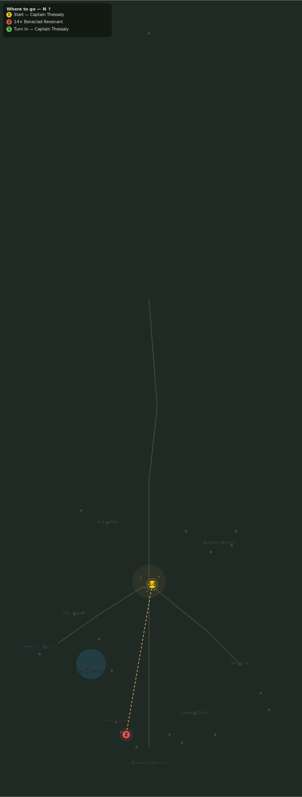

# Bones of the Vanguard

> Quest ID: `q_revenant_vanguard` · Zone 3 — Thornpeak Heights

| | |
|---|---|
| **Recommended level** | 13+ (zone range 13–20) |
| **Quest giver** | **Captain Thessaly**, Highwatch Captain _(at ~x:4, z:664)_ |
| **Turn in to** | **Captain Thessaly**, Highwatch Captain _(at ~x:4, z:664)_ |
| **Requires** | The Revenant Fields (`q_revenants`) |

## Story

> The revenants are forming ranks, <your name> — true ranks, shield-lines and columns, drilling with no drummer. They are being mustered for the Sanctum gate. Break fourteen more before that march begins, and Highwatch will owe you its best steel.

## How to complete

- **Kill 14× [Boneclad Revenant](bestiary.md#mob-boneclad_revenant)** (level 18–19)
  - Found in the open world at ~x:-40, z:830 (8 mobs, radius 20)
  - Found in the open world at ~x:-15, z:860 (6 mobs, radius 16)
  - _Tracker: Boneclad Revenant slain_

Then return to **Captain Thessaly**, Highwatch Captain _(at ~x:4, z:664)_ to turn in.

## Rewards

- **XP:** 4500
- **Money:** 2400 copper
- **Item reward (by class):**
  -  🟢 Boneplate Vest — _warrior_ · 170 armor, +3 Str, +6 Sta
  -  🟢 Revenant Silk Robe — _mage_ · 60 armor, +7 Int, +4 Spi
  -  🟢 Nightwalk Jerkin — _rogue_ · 105 armor, +7 Agi, +2 Sta

## On completion

> The fields lie still again. Take this — it was made for the defenders of the wall, and no one has earned it more.

## Where to go

**[🧭 Open this route in 3D →](#/questroute/q_revenant_vanguard)**

_Numbered route: ① start → objectives → 3 turn in. Faint dots are the rest of the zone for context — see the [full zone map](README.md). Mob names above link to the [bestiary](bestiary.md)._
