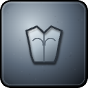
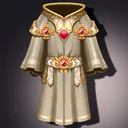
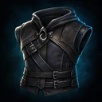
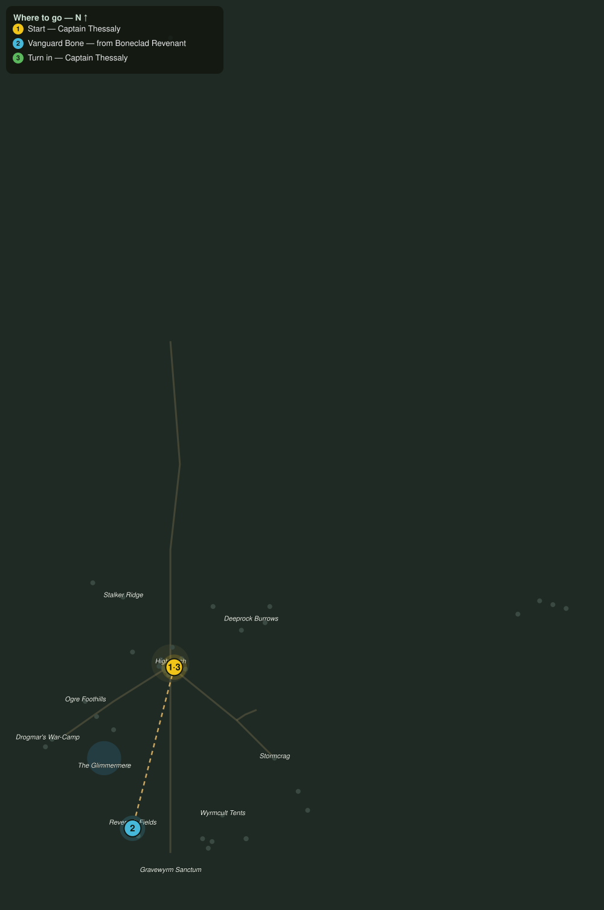

# Bones of the Vanguard

> Quest ID: `q_revenant_vanguard` · Zone 3 — Thornpeak Heights

| | |
|---|---|
| **Recommended level** | 13+ (zone range 13–20) |
| **Quest giver** | **Captain Thessaly**, Highwatch Captain _(at ~x:4, z:664)_ |
| **Turn in to** | **Captain Thessaly**, Highwatch Captain _(at ~x:4, z:664)_ |
| **Requires** | The Revenant Fields (`q_revenants`) |

## Story

> The revenants are forming ranks, <your name>, true ranks, shield-lines and columns, drilling with no drummer. Break their vanguard and bring me ten of their bones, so the smiths can read how they were bound. Do it before the march begins, and Highwatch will owe you its best steel.

## How to complete

- **Collect 10× Vanguard Bone**
  - Drops from [**Boneclad Revenant**](bestiary.md#mob-boneclad_revenant) (70% chance) — Found in the open world at ~x:-40, z:830 (8 mobs, radius 20); Found in the open world at ~x:-40, z:838 (6 mobs, radius 16)
  - _Tracker: Vanguard Bone recovered_

Then return to **Captain Thessaly**, Highwatch Captain _(at ~x:4, z:664)_ to turn in.

## Rewards

- **XP:** 4500
- **Money:** 2400 copper
- **Item reward (by class):**
  -  🟢 Boneplate Vest — _warrior_ · 170 armor, +3 Str, +5 Sta
  -  🟢 Revenant Silk Robe — _mage_ · 60 armor, +5 Int, +3 Spi
  -  🟢 Nightwalk Jerkin — _rogue_ · 105 armor, +6 Agi, +2 Sta

## On completion

> The fields lie still again. Take this — it was made for the defenders of the wall, and no one has earned it more.

## Where to go

**[🧭 Open this route in 3D →](#/questroute/q_revenant_vanguard)**

_Numbered route: ① start → objectives → 3 turn in. Faint dots are the rest of the zone for context — see the [full zone map](README.md). Mob names above link to the [bestiary](bestiary.md)._
