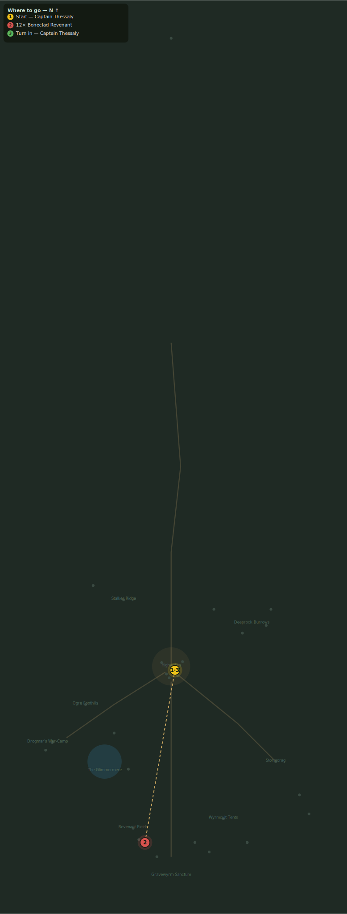

# The Revenant Fields

> Quest ID: `q_revenants` · Zone 3 — Thornpeak Heights

| | |
|---|---|
| **Recommended level** | 18+ |
| **Quest giver** | **Captain Thessaly**, Highwatch Captain _(at ~x:4, z:664)_ |
| **Turn in to** | **Captain Thessaly**, Highwatch Captain _(at ~x:4, z:664)_ |

## Story

> East of the Sanctum road lies an old battlefield — the vanguard of the last army that tried to take this mountain, two hundred years buried. The cult has called them up, bones in rusted plate. Put twelve revenants back in the ground, <your name>.

## How to complete

- **Kill 12× [Boneclad Revenant](bestiary.md#mob-boneclad_revenant)** (level 18–19)
  - Found in the open world at ~x:-40, z:830 (8 mobs, radius 20)
  - Found in the open world at ~x:-15, z:860 (6 mobs, radius 16)
  - _Tracker: Boneclad Revenant slain_

Then return to **Captain Thessaly**, Highwatch Captain _(at ~x:4, z:664)_ to turn in.

## Rewards

- **XP:** 4300
- **Money:** 2200 copper

## On completion

> They were soldiers once, like mine. Whatever called them up has no respect for the dead — or a use for them I do not care to learn.

## Leads to

- Bones of the Vanguard (`q_revenant_vanguard`)

## Where to go

_Numbered route: ① start → objectives → 3 turn in. Faint dots are the rest of the zone for context — see the [full zone map](README.md). Mob names above link to the [bestiary](bestiary.md)._
