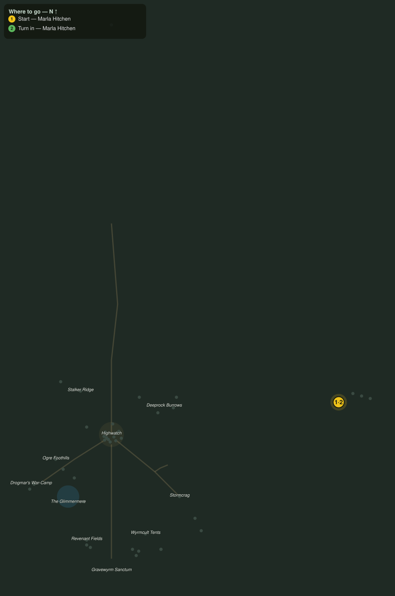

# Riding Lessons

> Quest ID: `q_riding_lessons` · Zone 3 — Thornpeak Heights

| | |
|---|---|
| **Recommended level** | 20+ |
| **Quest giver** | **Marla Hitchen**, Stablemaster _(at ~x:367, z:608)_ |
| **Turn in to** | **Marla Hitchen**, Stablemaster _(at ~x:367, z:608)_ |

## Story

> You have learned your Riding, <your name>, now show me you deserve it. When I give the word, call the training Valorsteed and climb aboard. Ride the course: follow the marker to the start arch, take every jump clean, and cross the line again before the glass runs dry. Do that and the course is yours. Wander out of the paddock and we start over.

## How to complete

- **Interact with train_valorsteed**
  - _Tracker: Tame the Valorsteed_

Then return to **Marla Hitchen**, Stablemaster _(at ~x:367, z:608)_ to turn in.

## Rewards

- **XP:** 3000
- **Money:** 5000 copper

## On completion

> Up in one clean motion and a steady seat at the top. Well ridden, $N. You have earned the rank of rider. Speak to me again to buy your own Valorsteed reins.

## Where to go

**[🧭 Open this route in 3D →](#/questroute/q_riding_lessons)**

_Numbered route: ① start → objectives → 3 turn in. Faint dots are the rest of the zone for context — see the [full zone map](README.md). Mob names above link to the [bestiary](bestiary.md)._
