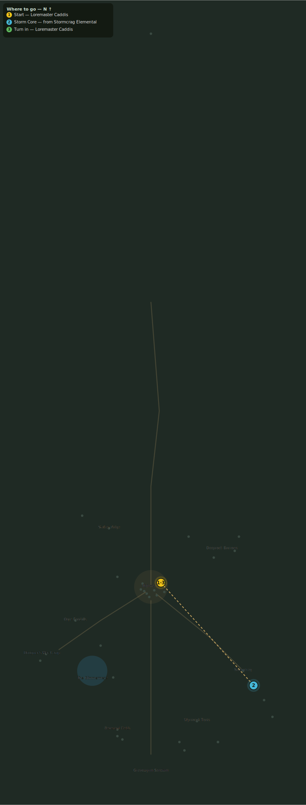

# Cores of the Storm

> Quest ID: `q_shard_cores` · Zone 3 — Thornpeak Heights

| | |
|---|---|
| **Recommended level** | 13+ (zone range 13–20) |
| **Quest giver** | **Loremaster Caddis**, Loremaster _(at ~x:12, z:655)_ |
| **Turn in to** | **Loremaster Caddis**, Loremaster _(at ~x:12, z:655)_ |
| **Requires** | The Mountain Wakes (`q_elementals`) |

## Story

> At each elemental's heart sits a storm core — a knot of lightning bound in stone. Six of them, set side by side, will tell me where the disturbance is centered. I suspect I already know, <your name>, and I dearly hope that I am wrong.

## How to complete

- **Collect 6× Storm Core**
  - Drops from [**Stormcrag Elemental**](bestiary.md#mob-stormcrag_elemental) (55% chance) — Found in the open world at ~x:110, z:760 (8 mobs, radius 20); Found in the open world at ~x:135, z:795 (6 mobs, radius 16)
  - _Tracker: Storm Core_

Then return to **Loremaster Caddis**, Loremaster _(at ~x:12, z:655)_ to turn in.

## Rewards

- **XP:** 3700
- **Money:** 1800 copper

## On completion

> Each core leans the same way, like iron filings to a lodestone. They point south, $N. To the Sanctum.

## Where to go

**[🧭 Open this route in 3D →](#/questroute/q_shard_cores)**

_Numbered route: ① start → objectives → 3 turn in. Faint dots are the rest of the zone for context — see the [full zone map](README.md). Mob names above link to the [bestiary](bestiary.md)._
