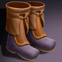
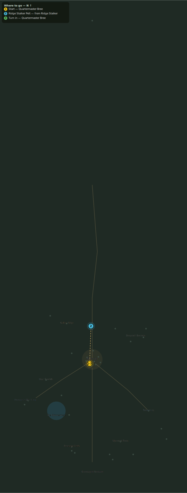

# Winter Is Coming to Highwatch

> Quest ID: `q_stalker_pelts` · Zone 3 — Thornpeak Heights

| | |
|---|---|
| **Recommended level** | 13+ (zone range 13–20) |
| **Quest giver** | **Quartermaster Bree**, Highwatch Quartermaster _(at ~x:-5, z:668)_ |
| **Turn in to** | **Quartermaster Bree**, Highwatch Quartermaster _(at ~x:-5, z:668)_ |

## Story

> Winter on this mountain does not knock, <your name> — it kicks the door in. Eight ridge stalker pelts will line enough cloaks to see the wall through the first snows. The beasts prowl the ridges flanking the road south.

## How to complete

- **Collect 8× Ridge Stalker Pelt**
  - Drops from [**Ridge Stalker**](bestiary.md#mob-ridge_stalker) (60% chance) — Found in the open world at ~x:-50, z:590 (7 mobs, radius 22); Found in the open world at ~x:45, z:600 (6 mobs, radius 20)
  - _Tracker: Ridge Stalker Pelt_

Then return to **Quartermaster Bree**, Highwatch Quartermaster _(at ~x:-5, z:668)_ to turn in.

## Rewards

- **XP:** 2300
- **Money:** 1000 copper
- **Item reward (by class):**
  -  🟢 Ridgestalker Treads — _warrior, mage, rogue_ · 50 armor, +3 Agi, +2 Sta

## On completion

> Thick as my arm, these. The watch will not freeze this year — take these treads for your trouble.

## Where to go

**[🧭 Open this route in 3D →](#/questroute/q_stalker_pelts)**

_Numbered route: ① start → objectives → 3 turn in. Faint dots are the rest of the zone for context — see the [full zone map](README.md). Mob names above link to the [bestiary](bestiary.md)._
