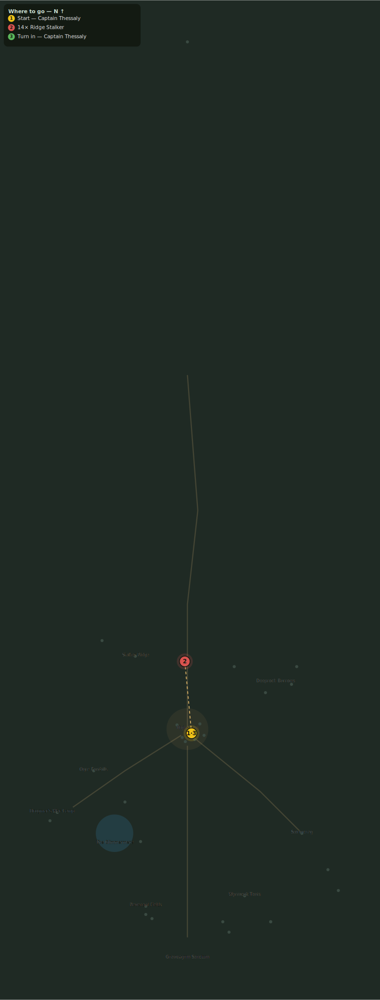

# The Stalkers Return

> Quest ID: `q_stalkers_return` · Zone 3 — Thornpeak Heights

| | |
|---|---|
| **Recommended level** | 13+ |
| **Quest giver** | **Captain Thessaly**, Highwatch Captain _(at ~x:4, z:664)_ |
| **Turn in to** | **Captain Thessaly**, Highwatch Captain _(at ~x:4, z:664)_ |
| **Requires** | Stalkers on the Ridge (`q_stalkers`) |

## Story

> Twelve dead, and the ridge crawls thicker than the day you started, <your name>. Beasts do not throw themselves at a wall out of hunger. Something on the high ridge is pushing them down, and until I know what, the culling does not stop. Fourteen more.

## How to complete

- **Kill 14× [Ridge Stalker](bestiary.md#mob-ridge_stalker)** (level 13–14)
  - Found in the open world at ~x:-50, z:590 (7 mobs, radius 22)
  - Found in the open world at ~x:45, z:600 (6 mobs, radius 20)
  - _Tracker: Ridge Stalker slain_

Then return to **Captain Thessaly**, Highwatch Captain _(at ~x:4, z:664)_ to turn in.

## Rewards

- **XP:** 2400
- **Money:** 1100 copper

## On completion

> Fourteen more, and still my patrols count fresh tracks by morning. My scout came back from the high ridge white as the snowline: prints the size of a shield, she says, and old kills no stalker would leave. Whatever walks up there is no ordinary cat.

## Leads to

- Old Cragmaw (`q_old_cragmaw`)

## Where to go

**[🧭 Open this route in 3D →](#/questroute/q_stalkers_return)**

_Numbered route: ① start → objectives → 3 turn in. Faint dots are the rest of the zone for context — see the [full zone map](README.md). Mob names above link to the [bestiary](bestiary.md)._
