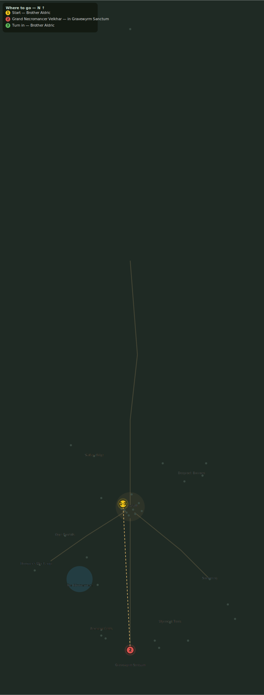

# The Grand Necromancer

> Quest ID: `q_velkhar` · Zone 3 — Thornpeak Heights

| | |
|---|---|
| **Recommended level** | 18+ |
| **Quest giver** | **Brother Aldric**, Priest of the Vale _(at ~x:-10, z:656)_ |
| **Turn in to** | **Brother Aldric**, Priest of the Vale _(at ~x:-10, z:656)_ |
| **Requires** | The Sanctum Gate (`q_sanctum_gate`) |
| **Group quest** | 👥 Suggested players: 5 |

## Story

> Every thread we have followed — Morthen, Vael, the phylacteries — was spun by one hand: Grand Necromancer Velkhar, first of the Gravecallers, keeper of the waking rite. He stands in the ritual vault below, pouring two lands' worth of stolen souls into the Wyrm. End him, <your name>, and the tithe ends with him.

## How to complete

- **Kill 1× [Grand Necromancer Velkhar](bestiary.md#mob-grand_necromancer_velkhar)** (level 20–20, **Elite**)
  - Inside dungeon [**Gravewyrm Sanctum**](../../../dungeons/gravewyrm_sanctum.md) (entrance portal ~x:0, z:880)
  - _Tracker: Grand Necromancer Velkhar slain_

Then return to **Brother Aldric**, Priest of the Vale _(at ~x:-10, z:656)_ to turn in.

## Rewards

- **XP:** 4500
- **Money:** 3000 copper
- **Item reward (by class):**
  -  🔵 Boneguard Breastplate — _warrior_ · 210 armor, +4 Str, +7 Sta
  -  🔵 Staff of Velkhar — _mage_ · 27–43 dmg @ 3s (~12 DPS), +10 Int, +5 Spi
  -  🔵 Shadowmeld Tunic — _rogue_ · 130 armor, +9 Agi, +4 Sta

## On completion

> Velkhar is dead, and the rite is headless. But you felt it down there, did you not? The souls are already spent — the Wyrm is no longer asleep.

## Leads to

- Korzul the Gravewyrm (`q_gravewyrm`)

## Where to go

_Numbered route: ① start → objectives → 3 turn in. Faint dots are the rest of the zone for context — see the [full zone map](README.md). Mob names above link to the [bestiary](bestiary.md)._
