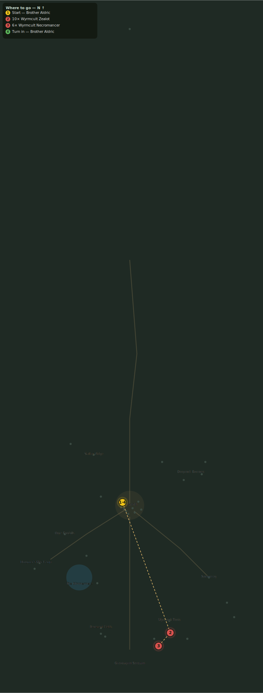

# The Voice Below

> Quest ID: `q_voice_below` · Zone 3 — Thornpeak Heights

| | |
|---|---|
| **Recommended level** | 13+ (zone range 13–20) |
| **Quest giver** | **Brother Aldric**, Priest of the Vale _(at ~x:-10, z:656)_ |
| **Turn in to** | **Brother Aldric**, Priest of the Vale _(at ~x:-10, z:656)_ |
| **Requires** | Breaking the Seal (`q_breaking_the_seal`) |

## Story

> Last night the whole cult camp knelt at once, <your name> — every zealot, every necromancer, all facing the Sanctum. Korzul speaks to them in their sleep now; Vael heard the same voice in the fen, and Morthen before him. Cut the congregation down — ten zealots, six necromancers — before that voice has hands enough to pull the gate open itself.

## How to complete

- **Kill 10× [Wyrmcult Zealot](bestiary.md#mob-wyrmcult_zealot)** (level 17–19)
  - Found in the open world at ~x:55, z:820 (8 mobs, radius 20)
  - Found in the open world at ~x:25, z:845 (6 mobs, radius 16)
  - Found in the open world at ~x:80, z:845 (2 mobs, radius 7)
  - _Tracker: Wyrmcult Zealot slain_
- **Kill 6× [Wyrmcult Necromancer](bestiary.md#mob-wyrmcult_necromancer)** (level 18–19)
  - Found in the open world at ~x:40, z:855 (5 mobs, radius 14)
  - _Tracker: Wyrmcult Necromancer slain_

Then return to **Brother Aldric**, Priest of the Vale _(at ~x:-10, z:656)_ to turn in.

## Rewards

- **XP:** 4400
- **Money:** 2400 copper
- **Item reward (by class):**
  -  🟢 Zealotsbane Blade — _warrior_ · 18–29 dmg @ 2.3s (~10 DPS), +6 Str, +2 Sta
  -  🟢 Emberwood Staff — _mage_ · 20–33 dmg @ 3s (~9 DPS), +6 Int, +2 Spi
  -  🟢 Cultist Flayer — _rogue_ · 12–19 dmg @ 1.7s (~9 DPS), +8 Agi

## On completion

> The kneeling has stopped. We have not silenced the voice, $N — only thinned its choir. It must be enough.

## Leads to

- The Sanctum Gate (`q_sanctum_gate`)

## Where to go

**[🧭 Open this route in 3D →](#/questroute/q_voice_below)**

_Numbered route: ① start → objectives → 4 turn in. Faint dots are the rest of the zone for context — see the [full zone map](README.md). Mob names above link to the [bestiary](bestiary.md)._
