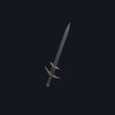
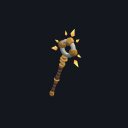
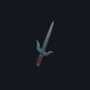
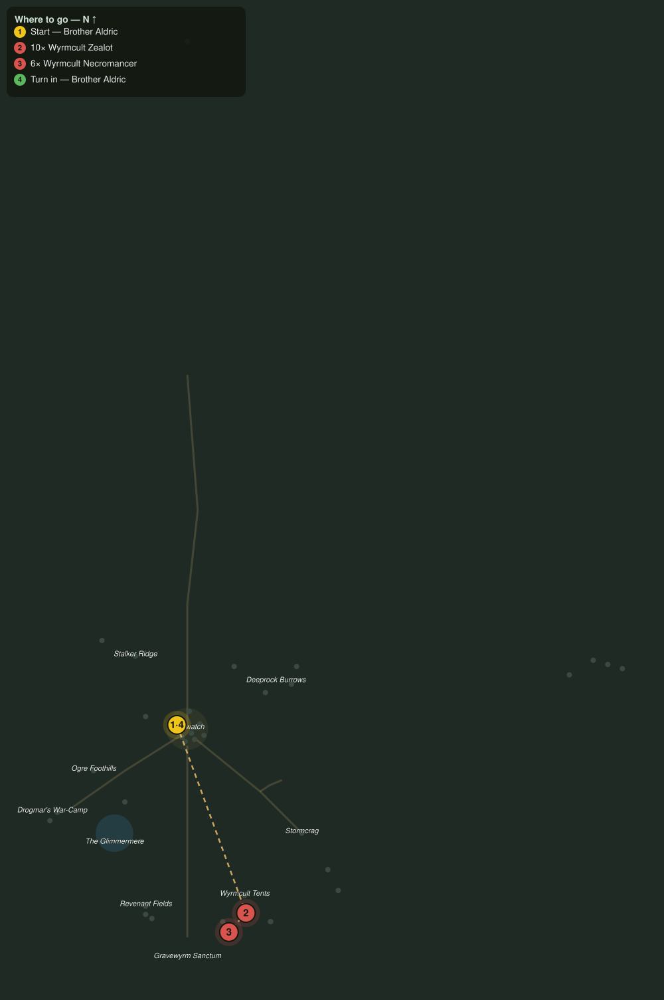

# The Voice Below

> Quest ID: `q_voice_below` · Zone 3 — Thornpeak Heights

| | |
|---|---|
| **Recommended level** | 13+ (zone range 13–20) |
| **Quest giver** | **Brother Aldric**, Priest of the Vale _(at ~x:-10, z:656)_ |
| **Turn in to** | **Brother Aldric**, Priest of the Vale _(at ~x:-10, z:656)_ |
| **Requires** | Breaking the Seal (`q_breaking_the_seal`) |

## Story

> Last night the whole cult camp knelt at once, <your name>, every zealot and necromancer facing the Sanctum, and one throat led the chant. They call him Threnos, the First Voice, and Korzul speaks through his mouth. Vael heard the same voice in the fen, and Morthen before him. Silence Threnos and cut down the six necromancers who keep his choir, before that voice has hands enough to pull the gate open itself.

## How to complete

- **Kill 1× [Threnos the First Voice](bestiary.md#mob-threnos_first_voice)** (level 19–19, **Elite**)
  - Found in the open world at ~x:44, z:848 (1 mob, radius 3)
  - _Tracker: Threnos the First Voice silenced_
- **Kill 6× [Wyrmcult Necromancer](bestiary.md#mob-wyrmcult_necromancer)** (level 18–19)
  - Found in the open world at ~x:40, z:855 (5 mobs, radius 14)
  - _Tracker: Wyrmcult Necromancer slain_

Then return to **Brother Aldric**, Priest of the Vale _(at ~x:-10, z:656)_ to turn in.

## Rewards

- **XP:** 4400
- **Money:** 2400 copper
- **Item reward (by class):**
  -  🟢 Zealotsbane Blade — _warrior_ · 18–29 dmg @ 2.3s (~10 DPS), +6 Str, +2 Sta
  -  🟢 Emberwood Staff — _mage_ · 20–33 dmg @ 3s (~9 DPS), +6 Int, +2 Spi
  -  🟢 Cultist Flayer — _rogue_ · 12–19 dmg @ 1.7s (~9 DPS), +8 Agi

## On completion

> Threnos is silent, and the kneeling has stopped, $N. We have not ended the voice below, only taken from it the mouth that carried it. It must be enough.

## Leads to

- The Sanctum Gate (`q_sanctum_gate`)

## Where to go

**[🧭 Open this route in 3D →](#/questroute/q_voice_below)**

_Numbered route: ① start → objectives → 4 turn in. Faint dots are the rest of the zone for context — see the [full zone map](README.md). Mob names above link to the [bestiary](bestiary.md)._
