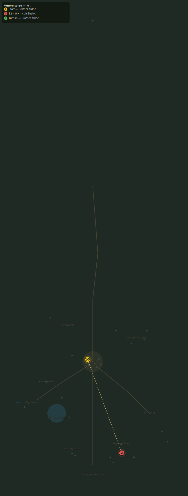

# Chants on the Wind

> Quest ID: `q_zealots` · Zone 3 — Thornpeak Heights

| | |
|---|---|
| **Recommended level** | 17+ |
| **Quest giver** | **Brother Aldric**, Priest of the Vale _(at ~x:-10, z:656)_ |
| **Turn in to** | **Brother Aldric**, Priest of the Vale _(at ~x:-10, z:656)_ |

## Story

> When the wind comes off the southern peaks, <your name>, it carries chanting. The Wyrmcult no longer hides — they have raised tents below the Sanctum and they sing to what sleeps beneath it. Silence twelve zealots. Every voice stilled buys the mountain another night of sleep.

## How to complete

- **Kill 12× [Wyrmcult Zealot](bestiary.md#mob-wyrmcult_zealot)** (level 17–19)
  - Found in the open world at ~x:55, z:820 (8 mobs, radius 20)
  - Found in the open world at ~x:25, z:845 (6 mobs, radius 16)
  - Found in the open world at ~x:80, z:845 (2 mobs, radius 7)
  - _Tracker: Wyrmcult Zealot slain_

Then return to **Brother Aldric**, Priest of the Vale _(at ~x:-10, z:656)_ to turn in.

## Rewards

- **XP:** 4000
- **Money:** 2000 copper

## On completion

> The wind is quieter. But what troubles me is not the chanting, $N — it is that something may be chanting back.

## Leads to

- Orders from Below (`q_cult_orders`)

## Where to go

**[🧭 Open this route in 3D →](#/questroute/q_zealots)**

_Numbered route: ① start → objectives → 3 turn in. Faint dots are the rest of the zone for context — see the [full zone map](README.md). Mob names above link to the [bestiary](bestiary.md)._
