# Bestiary — The Drowned Temple

6 creatures you'll fight in this zone. Health/armor/damage are shown across the mob's spawn level range (mobs roll a random level within it). Mitigation % is what a same-level attacker's physical hits lose to armor — spells ignore armor.

> Threat tiers: **Boss** (dungeon, group it) · **Elite** (~2.3× HP, ~1.5× damage) · **Rare** (tough roamer) · normal (everything else).

## Common creatures

### Drowned Votary

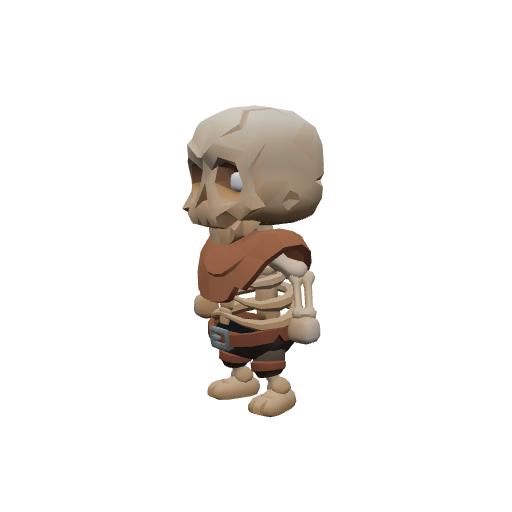

| Stat | Value |
|---|---|
| Level | 15–16 |
| Family | Undead |
| Health | 382–404 HP |
| Armor (physical mitigation) | 224–240 (~12% vs a same-level attacker) |
| Melee damage | 36–59 per hit @ 2s swing (~23–24 DPS) |

**Best way to kill:**

- Straightforward melee attacker — tank it, heal as needed, and burn it down. No special tricks.

**Loot:**

- Coins: 80 copper (always drops)

| Item | Type | Drop chance | Notes |
|---|---|---:|---|
|   Drowned Offering | Quest item | 60% | quest item — only drops while on _The Drowned Choir_ |
| 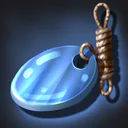 ⚫ Briny Idol | Junk | 30% | sells for 32c |

### Glimmermere Wader

| Stat | Value |
|---|---|
| Level | 15–16 |
| Family | Murloc |
| Health | 378–400 HP |
| Armor (physical mitigation) | 196–210 (~10–11% vs a same-level attacker) |
| Melee damage | 36–59 per hit @ 1.9s swing (~24–26 DPS) |

**Best way to kill:**

- Straightforward melee attacker — tank it, heal as needed, and burn it down. No special tricks.

**Loot:**

- Coins: 70 copper (always drops)

| Item | Type | Drop chance | Notes |
|---|---|---:|---|
|  ⚫ Pale Pearl | Junk | 40% | sells for 30c |
| 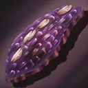 ⚫ Moonpale Scale | Junk | 30% | sells for 26c |

### Sethrael the Palecoil — _Rare_

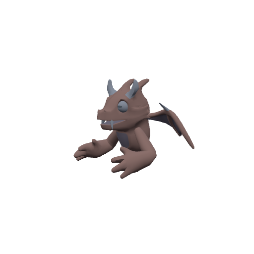

| Stat | Value |
|---|---|
| Level | 16 |
| Family | Dragonkin |
| Health | 595 HP |
| Armor (physical mitigation) | 330 (~16% vs a same-level attacker) |
| Melee damage | 44–69 per hit @ 2.2s swing (~26 DPS) |
| Respawn | ~2 min (rare spawn) |
| Spawn point | ~x:-96, z:814 |

**Best way to kill:**

- **Rare** — a tougher roaming spawn; worth killing for loot, but pull it solo.
- Straightforward melee attacker — tank it, heal as needed, and burn it down. No special tricks.

**Loot:**

- Coins: 500 copper (always drops)

| Item | Type | Drop chance | Notes |
|---|---|---:|---|
|   Sethrael's Heartscale | Quest item | 100% | quest item — only drops while on _Sethrael the Palecoil_ |
|  ⚫ Moonpale Scale | Junk | 100% | sells for 26c |
|  ⚫ Pale Pearl | Junk | 50% | sells for 30c |

## Elites

### Choirmother Selthe — _Elite_

| Stat | Value |
|---|---|
| Level | 18 |
| Family | Humanoid |
| Health | 1362 HP |
| Armor (physical mitigation) | 374 (~16% vs a same-level attacker) |
| Melee damage | 69–109 per hit @ 2.2s swing (~40 DPS) |
| Respawn | ~25s |

**Best way to kill:**

- **Elite** — ~2.3× the health and ~1.5× the damage of a normal mob; bring a group or out-level it.
- Straightforward melee attacker — tank it, heal as needed, and burn it down. No special tricks.

**Loot:**

- Coins: 700 copper (always drops)

| Item | Type | Drop chance | Notes |
|---|---|---:|---|
|  ⚫ Briny Idol | Junk | 50% | sells for 32c |
| 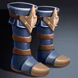 🔵 Selthe's Sea-Striders | Armor — Feet · 75 armor, +4 Agi, +3 Sta | 40% |  |

## Bosses

### Ysolei, Avatar of the Drowned Moon — _Boss · Elite_

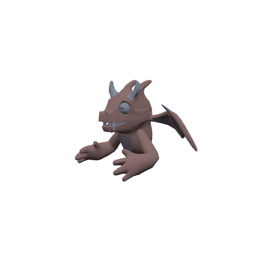

| Stat | Value |
|---|---|
| Level | 18 |
| Family | Dragonkin |
| Health | 2176 HP |
| Armor (physical mitigation) | 476 (~20% vs a same-level attacker) |
| Melee damage | 76–119 per hit @ 2.5s swing (~39 DPS) |
| Respawn | ~25s |

**Best way to kill:**

- **Boss** — fight it as a group in its dungeon; assign a tank and watch its mechanics below.
- Summons adds at HP thresholds — bring AoE or kill the adds fast; don't let them pile up.
- **Lunar Tide:** Pulses AoE damage around itself — healers expect steady raid damage; don't bring extra mobs into it.
- Enrages at low HP (hits much harder) — save burst/defensives for the execute, or kite while enraged.

**Loot:**

- Coins: 6000 copper (always drops)

| Item | Type | Drop chance | Notes |
|---|---|---:|---|
| 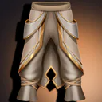 🔵 Ysolei's Pearl Greaves | Armor — Legs · 130 armor, +6 Sta, +3 Spi | 50% |  |
|  🔵 Moonshroud Breastplate | Armor — Chest · 200 armor, +4 Str, +7 Sta | 34% | exclusive set † |
|  🔵 Moonshroud Robe | Armor — Chest · 70 armor, +10 Int, +5 Spi | 33% | exclusive set † |
|  🔵 Moonshroud Tunic | Armor — Chest · 125 armor, +9 Agi, +4 Sta | 33% | exclusive set † |

† The exclusive set is rolled once — at most one of these items drops per kill.

### Nythraxis, Scourge of Thornpeak — _Boss · Elite_

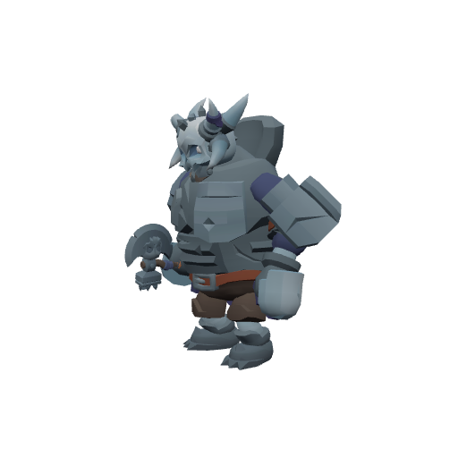

| Stat | Value |
|---|---|
| Level | 20 |
| Family | Undead |
| Health | 51239 HP |
| Armor (physical mitigation) | 798 (~28% vs a same-level attacker) |
| Melee damage | 325–507 per hit @ 2.6s swing (~160 DPS) |
| Crowd control | Immune |
| Respawn | ~25s |

**Best way to kill:**

- **Boss** — fight it as a group in its dungeon; assign a tank and watch its mechanics below.
- Immune to crowd control — it can't be stunned, feared, or polymorphed; just tank and burn.

**Loot:**

- Coins: 150000 copper (always drops)

| Item | Type | Drop chance | Notes |
|---|---|---:|---|
| 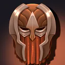 🟣 Crownforged Dreadhelm | Armor — Head · 310 armor, +12 Str, +14 Sta | 17% | exclusive set 1 † |
|  🟣 Crownforged Warspaulders | Armor — Shoulder · 260 armor, +10 Str, +12 Sta | 17% | exclusive set 2 † |
|  🟣 Crownforged Dreadhelm | Armor — Head · 310 armor, +12 Str, +14 Sta | 17% | exclusive set 3 † |
|  🟣 Nighttalon Crown | Armor — Head · 190 armor, +16 Agi, +10 Sta | 17% | exclusive set 3 † |
|  🟣 Soulflame Cowl | Armor — Head · 105 armor, +10 Sta, +17 Int | 17% | exclusive set 3 † |
| 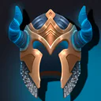 🟣 Stormcaller's Crown | Armor — Head · 225 armor, +12 Sta, +16 Int | 17% | exclusive set 3 † |
|  🟣 Soulflame Mantle | Armor — Shoulder · 92 armor, +9 Sta, +15 Int | 17% | exclusive set 4 † |
|  🟣 Crownforged Warspaulders | Armor — Shoulder · 260 armor, +10 Str, +12 Sta | 17% | exclusive set 4 † |
|  🟣 Nighttalon Shoulderguards | Armor — Shoulder · 165 armor, +14 Agi, +9 Sta | 17% | exclusive set 4 † |
|  🟣 Stormcaller's Spaulders | Armor — Shoulder · 190 armor, +11 Sta, +14 Int | 17% | exclusive set 4 † |
|  🟣 Nighttalon Crown | Armor — Head · 190 armor, +16 Agi, +10 Sta | 16% | exclusive set 1 † |
|  🟣 Soulflame Cowl | Armor — Head · 105 armor, +10 Sta, +17 Int | 16% | exclusive set 1 † |
|  🟣 Stormcaller's Crown | Armor — Head · 225 armor, +12 Sta, +16 Int | 16% | exclusive set 1 † |
|  🟣 Nighttalon Shoulderguards | Armor — Shoulder · 165 armor, +14 Agi, +9 Sta | 16% | exclusive set 1 † |
|  🟣 Soulflame Mantle | Armor — Shoulder · 92 armor, +9 Sta, +15 Int | 16% | exclusive set 1 † |
|  🟣 Nighttalon Shoulderguards | Armor — Shoulder · 165 armor, +14 Agi, +9 Sta | 16% | exclusive set 2 † |
|  🟣 Soulflame Mantle | Armor — Shoulder · 92 armor, +9 Sta, +15 Int | 16% | exclusive set 2 † |
|  🟣 Crownforged Dreadhelm | Armor — Head · 310 armor, +12 Str, +14 Sta | 16% | exclusive set 2 † |
|  🟣 Nighttalon Crown | Armor — Head · 190 armor, +16 Agi, +10 Sta | 16% | exclusive set 2 † |
|  🟣 Stormcaller's Spaulders | Armor — Shoulder · 190 armor, +11 Sta, +14 Int | 16% | exclusive set 2 † |
|  🟣 Nighttalon Shoulderguards | Armor — Shoulder · 165 armor, +14 Agi, +9 Sta | 16% | exclusive set 3 † |
|  🟣 Soulflame Mantle | Armor — Shoulder · 92 armor, +9 Sta, +15 Int | 16% | exclusive set 3 † |
|  🟣 Crownforged Dreadhelm | Armor — Head · 310 armor, +12 Str, +14 Sta | 16% | exclusive set 4 † |
|  🟣 Nighttalon Crown | Armor — Head · 190 armor, +16 Agi, +10 Sta | 16% | exclusive set 4 † |
| 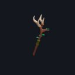 🟠 Heartwood of the Deathless Crown | Weapon — Main hand · 42–68 dmg @ 3.2s (~17 DPS), +24 Agi, +18 Sta, +20 Int | 3% | exclusive set 1 † |
| 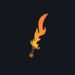 🟠 Kingsbane, Last Oath of Thornpeak | Weapon — Main hand · 46–74 dmg @ 2.8s (~21 DPS), +24 Str, +20 Sta | 3% | exclusive set 2 † |

† Each exclusive set is rolled separately — at most one item from each set drops per kill.

---

[← Back to The Drowned Temple quests](README.md) · [Zone map](map.svg)
