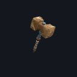
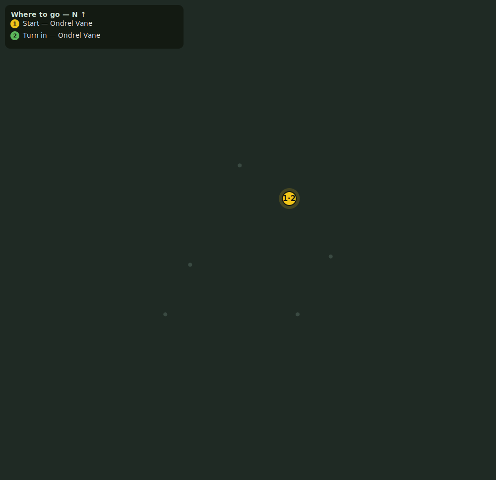

# The Drowned Moon

> Quest ID: `q_drowned_moon` · Zone 4 — The Drowned Temple (Endgame)

| | |
|---|---|
| **Recommended level** | 16+ |
| **Quest giver** | **Ondrel Vane**, Tidewatcher _(at ~x:-66, z:786)_ |
| **Turn in to** | **Ondrel Vane**, Tidewatcher _(at ~x:-66, z:786)_ |
| **Requires** | Silence the Choir (`q_silence_the_choir`) |
| **Group quest** | 👥 Suggested players: 5 |

## Story

> I have read the last of the rubbings, <your name>, and I understand now what the cult drowned themselves to keep asleep. Ysolei — the Drowned Moon made flesh — coils on the altar at the temple's heart, and the stolen warmth of every life the mere took is pouring into her waking. When the moon stands full she rises, and the water rises with her — the tarn, the wall, the whole mountain under it. Gather the strongest you can find and put her back to sleep. For good, this time.

## How to complete

- **Kill 1× [Ysolei, Avatar of the Drowned Moon](bestiary.md#mob-ysolei)** (level 18–18, **Boss**, **Elite**)
  - _Spawns as part of a scripted encounter_
  - _Tracker: Ysolei, Avatar of the Drowned Moon, slain_

Then return to **Ondrel Vane**, Tidewatcher _(at ~x:-66, z:786)_ to turn in.

## Rewards

- **XP:** 5000
- **Money:** 12000 copper
- **Item reward (by class):**
  -  🔵 Drowned Moon Maul — _warrior_ · 24–38 dmg @ 2.6s (~12 DPS), +8 Str, +4 Sta
  -  🔵 Drowned Moon Scepter — _mage_ · 26–42 dmg @ 3s (~11 DPS), +10 Int, +4 Spi
  -  🔵 Drowned Moon Kris — _rogue_ · 16–25 dmg @ 1.7s (~12 DPS), +9 Agi, +3 Sta

## On completion

> The altar is dark, the water is still, and the moon over the tarn is only the moon. You drowned a goddess tonight, $N — and the mountain will never know how close it came. Let the wardens of the shore-rocks rest easy at last.

## Where to go

_Numbered route: ① start → objectives → 3 turn in. Faint dots are the rest of the zone for context — see the [full zone map](README.md). Mob names above link to the [bestiary](bestiary.md)._
