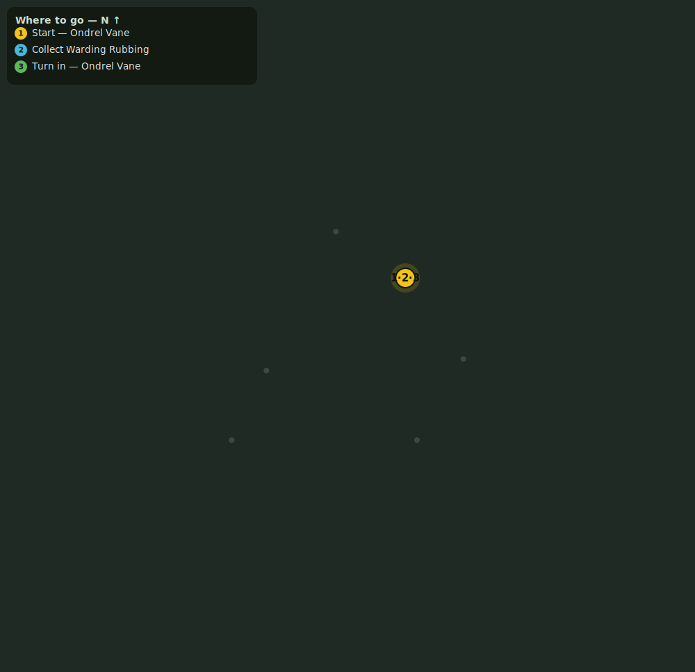

# Light on the Water

> Quest ID: `q_glimmermere_light` · Zone 4 — The Drowned Temple (Endgame)

| | |
|---|---|
| **Recommended level** | 15+ |
| **Quest giver** | **Ondrel Vane**, Tidewatcher _(at ~x:-66, z:786)_ |
| **Turn in to** | **Ondrel Vane**, Tidewatcher _(at ~x:-66, z:786)_ |

## Story

> Look there, <your name> — under the surface, a stair of pale stone running down into the dark, and a gate of cold light at the head of it. The old wardens scratched warnings into the shore-rocks before the water took them. Take a rubbing of one for me; I would read what they feared before we go any closer.

## How to complete

- **Collect 1× Warding Rubbing**
  - Pick up from the ground (sparkle objects) at: ~x:-74, z:786 · ~x:-68, z:783 · ~x:-76, z:796 · ~x:-64, z:794
  - _Tracker: Warding Rubbing taken_

Then return to **Ondrel Vane**, Tidewatcher _(at ~x:-66, z:786)_ to turn in.

## Rewards

- **XP:** 3200
- **Money:** 1500 copper

## On completion

> A waking-prayer... to something they called the Drowned Moon. And below it, in a steadier hand: "It only sleeps." The water has been listening a long time, $N.

## Leads to

- What the Tarn Gives Up (`q_tarn_waders`)

## Where to go

_Numbered route: ① start → objectives → 3 turn in. Faint dots are the rest of the zone for context — see the [full zone map](README.md). Mob names above link to the [bestiary](bestiary.md)._
