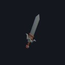
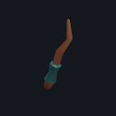

# Sethrael the Palecoil

> Quest ID: `q_palecoil` · Zone 4 — The Drowned Temple (Endgame)

| | |
|---|---|
| **Recommended level** | 16+ |
| **Quest giver** | **Ondrel Vane**, Tidewatcher _(at ~x:-66, z:786)_ |
| **Turn in to** | **Ondrel Vane**, Tidewatcher _(at ~x:-66, z:786)_ |
| **Requires** | What the Tarn Gives Up (`q_tarn_waders`) |

## Story

> One shape in the mere is no drowned man. A serpent the colour of bone glides the deep shelf where the stair begins — Sethrael, the rubbings call it, the Palecoil, the moon's own watch-beast. While it guards that water, no one reaches the gate alive. Go down to the shelf and kill it, <your name>. Take its heartscale so I know the deed is done.

## How to complete

- **Collect 1× Sethrael's Heartscale**
  - Drops from [**Sethrael the Palecoil**](bestiary.md#mob-sethrael_palecoil) (100% chance) — Found in the open world at ~x:-96, z:814 (1 mob, radius 3)
  - _Tracker: Sethrael's Heartscale_

Then return to **Ondrel Vane**, Tidewatcher _(at ~x:-66, z:786)_ to turn in.

## Rewards

- **XP:** 4000
- **Money:** 2000 copper
- **Item reward (by class):**
  -  🟢 Moonscale Saber — _warrior_ · 17–28 dmg @ 2.4s (~9 DPS), +5 Str, +2 Sta
  -  🟢 Palecoil Rod — _mage_ · 18–31 dmg @ 3s (~8 DPS), +6 Int, +2 Spi
  -  🟢 Tideglass Dirk — _rogue_ · 11–18 dmg @ 1.7s (~9 DPS), +6 Agi

## On completion

> Cold as the bottom of the world, and still it twitches. The shelf is clear, $N — the stair to the gate stands open. I almost wish it did not.

## Zone map

_Gold = NPCs · red = mob camps · purple = dungeons · green = ground pickups. Match the names above to the markers._

See the **[zone bestiary](bestiary.md)** for the health, armor, and kill tactics of every mob named above.
