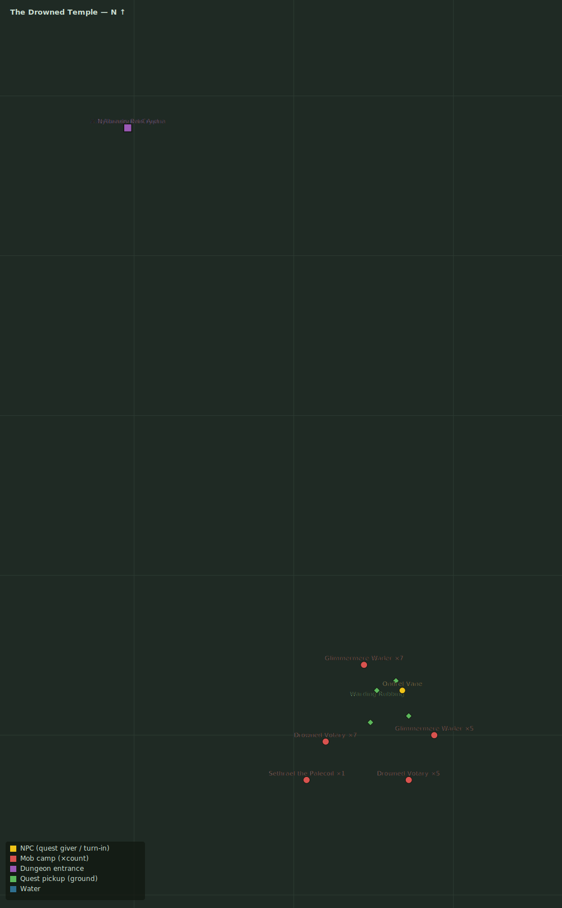

# What the Tarn Gives Up

> Quest ID: `q_tarn_waders` · Zone 4 — The Drowned Temple (Endgame)

| | |
|---|---|
| **Recommended level** | 15+ (zone range 15–16) |
| **Quest giver** | **Ondrel Vane**, Tidewatcher _(at ~x:-66, z:786)_ |
| **Turn in to** | **Ondrel Vane**, Tidewatcher _(at ~x:-66, z:786)_ |
| **Requires** | Light on the Water (`q_glimmermere_light`) |

## Story

> Since the gate opened, things climb out of the mere at dusk — bloated, pale, finned where hands ought to be. Glimmermere Waders, the old rubbings name them. They drag anything living back down with them. Cull ten before they thin my watch to nothing.

## How to complete

- **Kill 10× [Glimmermere Wader](bestiary.md#mob-glimmermere_wader)** (level 15–16)
  - Found in the open world at ~x:-78, z:778 (7 mobs, radius 16)
  - Found in the open world at ~x:-56, z:800 (5 mobs, radius 14)
  - _Tracker: Glimmermere Wader slain_

Then return to **Ondrel Vane**, Tidewatcher _(at ~x:-66, z:786)_ to turn in.

## Rewards

- **XP:** 3400
- **Money:** 1600 copper

## On completion

> Ten back in the water. They feel no cold, $N, and no fear — only the pull of that gate. Whatever sings to them, it sings loud.

## Leads to

- The Drowned Choir (`q_drowned_choir`)
- Sethrael the Palecoil (`q_palecoil`)

## Zone map

_Gold = NPCs · red = mob camps · purple = dungeons · green = ground pickups. Match the names above to the markers._

See the **[zone bestiary](bestiary.md)** for the health, armor, and kill tactics of every mob named above.
