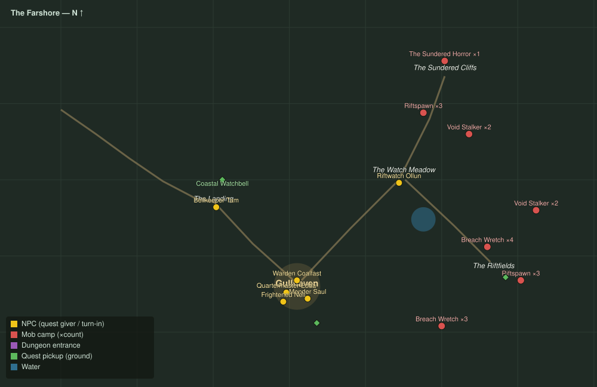

# The Farshore

Level range: **3–7** · Hub: Gullhaven · 9 quests

_Gold = NPCs · red = mob camps (×count) · purple = dungeon entrances · green = ground pickups · blue = water._

📖 **[Bestiary for this zone](bestiary.md)** — every mob's health, armor, damage, and how to kill it.

| Lvl | Quest | Giver | Type |
|----:|-------|-------|------|
| 2 | [The Bell at the Landing](q-fs-bell-at-the-landing.md) | Bellkeeper Tam | interact |
| 3 | [Hold the Riftfields](q-fs-hold-the-riftfields.md) | Warden Coalfast | kill |
| 3 | [Steel for the Redoubt](q-fs-steel-for-the-redoubt.md) | Quartermaster Edda | collect |
| 3 | [The Three Bells](q-fs-the-three-bells.md) | Bellkeeper Tam | interact |
| 4 | [The Song Before the Break](q-fs-song-before-the-break.md) | Warden Coalfast | interact |
| 4 | [Moss and Mending](q-fs-moss-and-mending.md) | Mender Saul | kill/collect |
| 5 | [Bram Come Home](q-fs-bram-come-home.md) | Frightened Nell | escort |
| 5 | [Stalkers off the Light](q-fs-stalkers-off-the-light.md) | Riftwatch Ollun | kill |
| 6 | [The Great Break](q-fs-the-great-break.md) 👥 | Riftwatch Ollun | kill |
