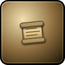
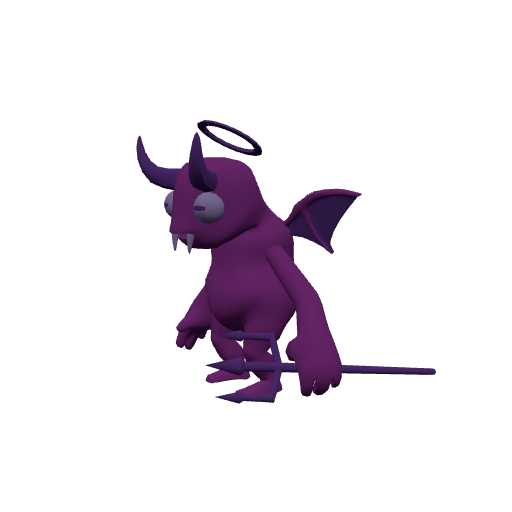
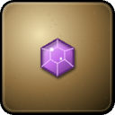
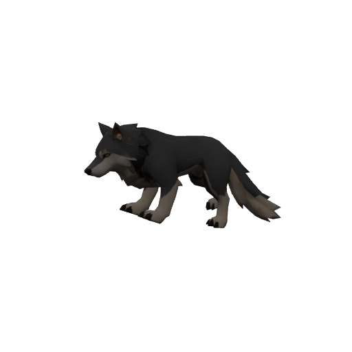
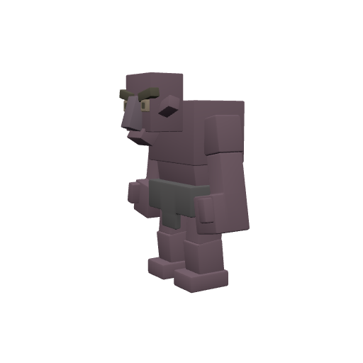

# Bestiary — The Farshore

4 creatures you'll fight in this zone. Health/armor/damage are shown across the mob's spawn level range (mobs roll a random level within it). Mitigation % is what a same-level attacker's physical hits lose to armor — spells ignore armor.

> Threat tiers: **Boss** (dungeon, group it) · **Elite** (~2.3× HP, ~1.5× damage) · **Rare** (tough roamer) · normal (everything else).

## Common creatures

### Breach Wretch

| Stat | Value |
|---|---|
| Level | 3–5 |
| Family | Kobold |
| Health | 52–74 HP |
| Armor (physical mitigation) | 14–28 (~2–3% vs a same-level attacker) |
| Melee damage | 7–15 per hit @ 1.8s swing (~5–7 DPS) |
| Location | The Farshore · ~x:430, z:44 · ~x:400, z:96 — [🗺️ show on map](#/map/430/44) |

**Best way to kill:**

- Straightforward melee attacker — tank it, heal as needed, and burn it down. No special tricks.

**Loot:**

- Coins: 18 copper (always drops)

| Item | Type | Drop chance | Notes |
|---|---|---:|---|
|   Break-Scarred Steel | Quest item | 60% | quest item — only drops while on _Steel for the Redoubt_ |

### Riftspawn

| Stat | Value |
|---|---|
| Level | 3–4 |
| Family | Demon |
| Health | 58–70 HP |
| Armor (physical mitigation) | 16–24 (~2–3% vs a same-level attacker) |
| Melee damage | 8–15 per hit @ 1.9s swing (~6 DPS) |
| Location | The Farshore · ~x:452, z:66 · ~x:388, z:-44 — [🗺️ show on map](#/map/452/66) |

**Best way to kill:**

- Straightforward melee attacker — tank it, heal as needed, and burn it down. No special tricks.

**Loot:**

- Coins: 15 copper (always drops)

| Item | Type | Drop chance | Notes |
|---|---|---:|---|
|   Farshore Salt Moss | Quest item | 60% | quest item — only drops while on _Moss and Mending_ |

### Void Stalker

| Stat | Value |
|---|---|
| Level | 5–6 |
| Family | Beast |
| Health | 116–132 HP |
| Armor (physical mitigation) | 44–55 (~5–6% vs a same-level attacker) |
| Melee damage | 15–26 per hit @ 1.7s swing (~11–12 DPS) |
| Location | The Farshore · ~x:418, z:-30 · ~x:462, z:20 — [🗺️ show on map](#/map/418/-30) |

**Best way to kill:**

- Straightforward melee attacker — tank it, heal as needed, and burn it down. No special tricks.

**Loot:**

- Coins: 26 copper (always drops)

## Elites

### The Sundered Horror — _Elite_

| Stat | Value |
|---|---|
| Level | 7 |
| Family | Ogre |
| Health | 626 HP |
| Armor (physical mitigation) | 90 (~8% vs a same-level attacker) |
| Melee damage | 36–56 per hit @ 2.4s swing (~19 DPS) |
| Respawn | ~25s |
| Location | The Farshore · ~x:402, z:-78 — [🗺️ show on map](#/map/402/-78) |

**Best way to kill:**

- **Elite** — ~2.3× the health and ~1.5× the damage of a normal mob; bring a group or out-level it.
- Straightforward melee attacker — tank it, heal as needed, and burn it down. No special tricks.

**Loot:**

- Coins: 150 copper (always drops)

---

[← Back to The Farshore quests](README.md) · [Zone map](map.svg)
