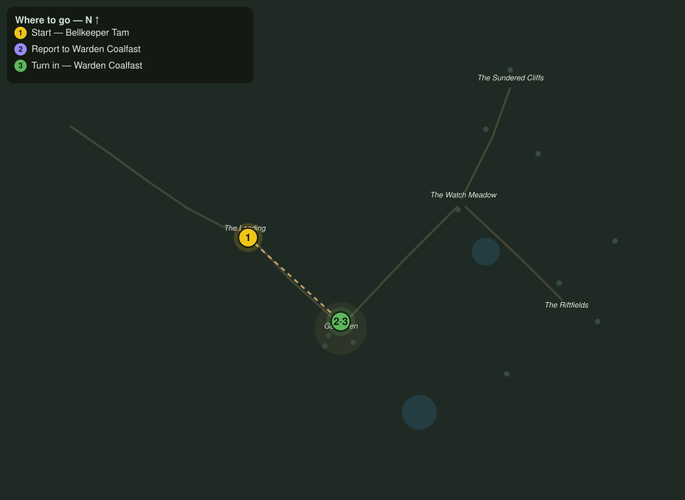

# The Bell at the Landing

> Quest ID: `q_fs_bell_at_the_landing` · The Farshore

| | |
|---|---|
| **Recommended level** | 2+ |
| **Quest giver** | **Bellkeeper Tam**, Watchbell Keeper _(at ~x:252, z:18)_ |
| **Turn in to** | **Warden Coalfast**, Redoubt Commander _(at ~x:305, z:66)_ |

## Story

> You came over the Ferrywalk, <your name>? Then you are the first in a week, and the Warden will want to look you over. Gullhaven sits up the shore road, past the drying racks nobody tends anymore. Tell Warden Coalfast the causeway still stands, and that Tam has not rung a three-toll today. Yet.

## How to complete

- **Interact with **Warden Coalfast**, Redoubt Commander _(at ~x:305, z:66)_**
  - _Tracker: Report to Warden Coalfast_

Then return to **Warden Coalfast**, Redoubt Commander _(at ~x:305, z:66)_ to turn in.

## Rewards

- **XP:** 150
- **Money:** 60 copper

## On completion

> The causeway holds, and Tam still has breath enough to joke about the three-toll. Good. We are an island under siege, $N, and every pair of hands that crosses that sandbar is a pair the breaks must get through before they reach my people. Welcome to Gullhaven.

## Leads to

- Hold the Riftfields (`q_fs_hold_the_riftfields`)
- Steel for the Redoubt (`q_fs_steel_for_the_redoubt`)
- The Three Bells (`q_fs_the_three_bells`)
- Moss and Mending (`q_fs_moss_and_mending`)
- Bram Come Home (`q_fs_bram_come_home`)

## Where to go

**[🧭 Open this route in 3D →](#/questroute/q_fs_bell_at_the_landing)**

_Numbered route: ① start → objectives → 3 turn in. Faint dots are the rest of the zone for context — see the [full zone map](README.md). Mob names above link to the [bestiary](bestiary.md)._
