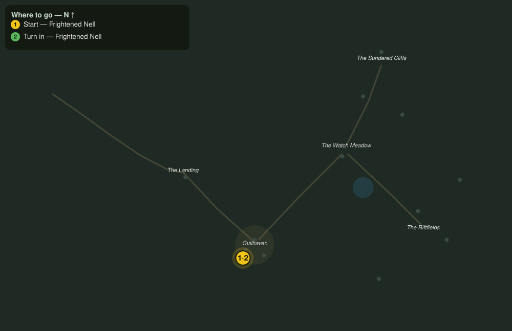

# Bram Come Home

> Quest ID: `q_fs_bram_come_home` · The Farshore

| | |
|---|---|
| **Recommended level** | 5+ |
| **Quest giver** | **Frightened Nell**, Gullhaven Fisher _(at ~x:296, z:80)_ |
| **Turn in to** | **Frightened Nell**, Gullhaven Fisher _(at ~x:296, z:80)_ |
| **Requires** | The Bell at the Landing (`q_fs_bell_at_the_landing`) |

## Story

> My Bram took the boat out the morning the nets-break opened, and the sea threw him back somewhere past the Landing point. I heard him three nights ago, <your name>, calling over the water, and I was too afraid to go. I am still too afraid. Please. His boat lies wrecked on the south shore. Walk him home to me.

## How to complete

  - _Tracker: Fisher Bram seen safely home to Gullhaven_

Then return to **Frightened Nell**, Gullhaven Fisher _(at ~x:296, z:80)_ to turn in.

## Rewards

- **XP:** 800
- **Money:** 400 copper

## On completion

> Bram! You brought him back to me whole, $N. We both wept and neither of us is ashamed. Whatever the breaks take from this island next, they do not get my family. Not anymore.

## Where to go

**[🧭 Open this route in 3D →](#/questroute/q_fs_bram_come_home)**

_Numbered route: ① start → objectives → 3 turn in. Faint dots are the rest of the zone for context — see the [full zone map](README.md). Mob names above link to the [bestiary](bestiary.md)._
