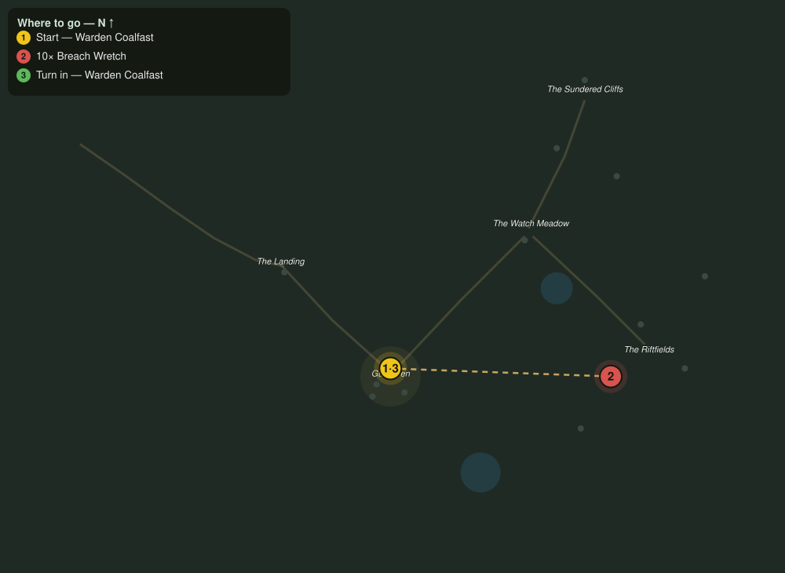

# Hold the Riftfields

> Quest ID: `q_fs_hold_the_riftfields` · The Farshore

| | |
|---|---|
| **Recommended level** | 3+ (zone range 3–7) |
| **Quest giver** | **Warden Coalfast**, Redoubt Commander _(at ~x:305, z:66)_ |
| **Turn in to** | **Warden Coalfast**, Redoubt Commander _(at ~x:305, z:66)_ |
| **Requires** | The Bell at the Landing (`q_fs_bell_at_the_landing`) |

## Story

> East of town the grain rows have gone to wrack, and the wretches that came through the Riftfields break now pick them clean. My people cannot tend a field they cannot stand in, <your name>. Cull ten of the wretches and give the farmers back their ground.

## How to complete

- **Kill 10× [Breach Wretch](bestiary.md#mob-breach_wretch)** (level 3–5)
  - Found in the open world at ~x:430, z:44 (4 mobs, radius 12)
  - Found in the open world at ~x:400, z:96 (3 mobs, radius 11)
  - _Tracker: Breach Wretch slain_

Then return to **Warden Coalfast**, Redoubt Commander _(at ~x:305, z:66)_ to turn in.

## Rewards

- **XP:** 400
- **Money:** 180 copper

## On completion

> Ten fewer, and the field hands are already arguing over who walks out first. It will not last, the breaks never rest long, but a town that eats is a town that holds.

## Leads to

- The Song Before the Break (`q_fs_song_before_the_break`)

## Where to go

**[🧭 Open this route in 3D →](#/questroute/q_fs_hold_the_riftfields)**

_Numbered route: ① start → objectives → 3 turn in. Faint dots are the rest of the zone for context — see the [full zone map](README.md). Mob names above link to the [bestiary](bestiary.md)._
