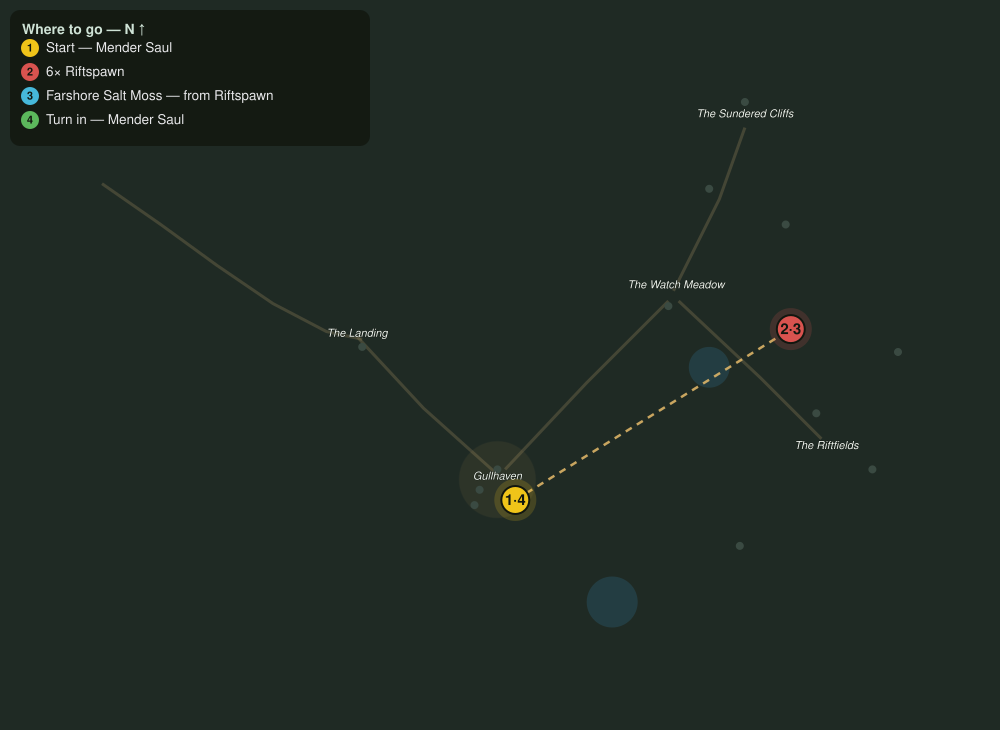

# Moss and Mending

> Quest ID: `q_fs_moss_and_mending` · The Farshore

| | |
|---|---|
| **Recommended level** | 4+ |
| **Quest giver** | **Mender Saul**, Field Surgeon _(at ~x:312, z:78)_ |
| **Turn in to** | **Mender Saul**, Field Surgeon _(at ~x:312, z:78)_ |
| **Requires** | The Bell at the Landing (`q_fs_bell_at_the_landing`) |

## Story

> The salt moss that grows along the tideline is the best wound-packing I know, and the riftspawn have claimed every stretch of shore it grows on. They carry tufts of it snagged on their hides, of all things. Clear six of them off the east reaches, <your name>, and pull me four good handfuls of moss from what they have trampled through.

## How to complete

- **Kill 6× [Riftspawn](bestiary.md#mob-riftspawn)** (level 3–4)
  - Found in the open world at ~x:452, z:66 (3 mobs, radius 11)
  - Found in the open world at ~x:388, z:-44 (3 mobs, radius 11)
  - _Tracker: Riftspawn slain_
- **Collect 4× Farshore Salt Moss**
  - Drops from [**Riftspawn**](bestiary.md#mob-riftspawn) (60% chance) — Found in the open world at ~x:452, z:66 (3 mobs, radius 11); Found in the open world at ~x:388, z:-44 (3 mobs, radius 11)
  - _Tracker: Farshore Salt Moss_

Then return to **Mender Saul**, Field Surgeon _(at ~x:312, z:78)_ to turn in.

## Rewards

- **XP:** 700
- **Money:** 350 copper

## On completion

> Moss in one hand and a quieter shoreline in the other. You have restocked my whole surgery, $N. Do me the kindness of not becoming my next patient.

## Where to go

**[🧭 Open this route in 3D →](#/questroute/q_fs_moss_and_mending)**

_Numbered route: ① start → objectives → 4 turn in. Faint dots are the rest of the zone for context — see the [full zone map](README.md). Mob names above link to the [bestiary](bestiary.md)._
