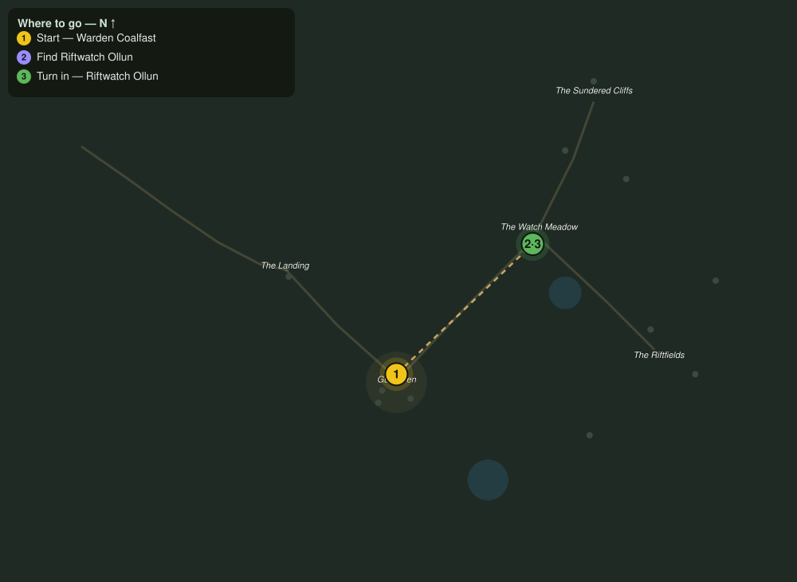

# The Song Before the Break

> Quest ID: `q_fs_song_before_the_break` · The Farshore

| | |
|---|---|
| **Recommended level** | 4+ |
| **Quest giver** | **Warden Coalfast**, Redoubt Commander _(at ~x:305, z:66)_ |
| **Turn in to** | **Riftwatch Ollun**, Breach Scholar _(at ~x:372, z:2)_ |
| **Requires** | Hold the Riftfields (`q_fs_hold_the_riftfields`) |

## Story

> There is a man who hears the breaks before they open. Riftwatch Ollun: a scholar, or a madman, and lately I cannot afford the difference. He keeps his vigil at the Watch Meadow, up the road southeast of town. Find him, <your name>, and ask him what the island is about to do to us next.

## How to complete

- **Interact with **Riftwatch Ollun**, Breach Scholar _(at ~x:372, z:2)_**
  - _Tracker: Find Riftwatch Ollun_

Then return to **Riftwatch Ollun**, Breach Scholar _(at ~x:372, z:2)_ to turn in.

## Rewards

- **XP:** 250
- **Money:** 100 copper

## On completion

> The Warden sent you? Good. That means the town has finally started listening. Now be still a moment, $N. There, under the wind, do you hear it? The cliffs are singing, and I do not like the tune.

## Leads to

- Stalkers off the Light (`q_fs_stalkers_off_the_light`)

## Where to go

**[🧭 Open this route in 3D →](#/questroute/q_fs_song_before_the_break)**

_Numbered route: ① start → objectives → 3 turn in. Faint dots are the rest of the zone for context — see the [full zone map](README.md). Mob names above link to the [bestiary](bestiary.md)._
