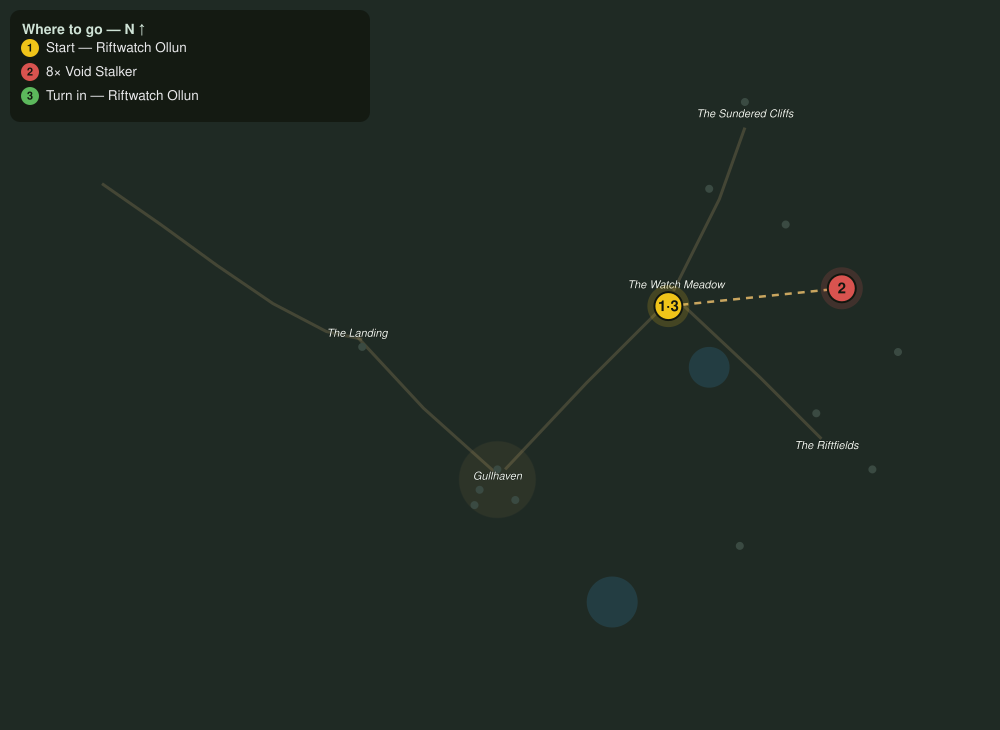

# Stalkers off the Light

> Quest ID: `q_fs_stalkers_off_the_light` · The Farshore

| | |
|---|---|
| **Recommended level** | 5+ |
| **Quest giver** | **Riftwatch Ollun**, Breach Scholar _(at ~x:372, z:2)_ |
| **Turn in to** | **Riftwatch Ollun**, Breach Scholar _(at ~x:372, z:2)_ |
| **Requires** | The Song Before the Break (`q_fs_song_before_the_break`) |

## Story

> The stalkers hunt the dark between the watchfires, and every night they circle my meadow a little closer. They are not mindless, <your name>, they are patient, and patience is the one thing I cannot outlast. Kill eight and push the dark back to the cliffs it came through.

## How to complete

- **Kill 8× [Void Stalker](bestiary.md#mob-void_stalker)** (level 5–6)
  - Found in the open world at ~x:418, z:-30 (2 mobs, radius 12)
  - Found in the open world at ~x:462, z:20 (2 mobs, radius 11)
  - _Tracker: Void Stalker slain_

Then return to **Riftwatch Ollun**, Breach Scholar _(at ~x:372, z:2)_ to turn in.

## Rewards

- **XP:** 600
- **Money:** 300 copper

## On completion

> Eight nights of circling, ended in one. The fires burn steadier already, or perhaps that is only my hands. Either way the meadow is mine again, and I can hear the island think.

## Leads to

- The Great Break (`q_fs_the_great_break`)

## Where to go

**[🧭 Open this route in 3D →](#/questroute/q_fs_stalkers_off_the_light)**

_Numbered route: ① start → objectives → 3 turn in. Faint dots are the rest of the zone for context — see the [full zone map](README.md). Mob names above link to the [bestiary](bestiary.md)._
