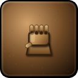
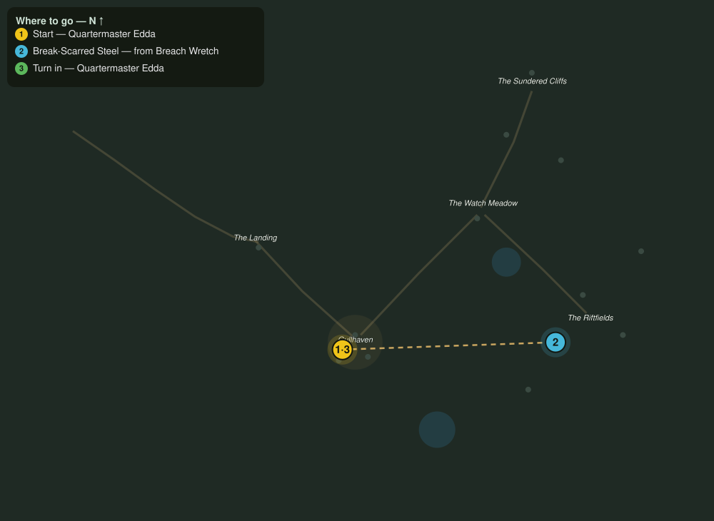

# Steel for the Redoubt

> Quest ID: `q_fs_steel_for_the_redoubt` · The Farshore

| | |
|---|---|
| **Recommended level** | 3+ (zone range 3–7) |
| **Quest giver** | **Quartermaster Edda**, Redoubt Armorer _(at ~x:298, z:74)_ |
| **Turn in to** | **Quartermaster Edda**, Redoubt Armorer _(at ~x:298, z:74)_ |
| **Requires** | The Bell at the Landing (`q_fs_bell_at_the_landing`) |

## Story

> Every blade I hand out is one the sea gave back or one I pried off the dead, <your name>. The wretches carry scrap through the breaks, hinges, hooks, broken sword-steel, magpie stuff, but it hammers out true. Bring me six pieces of their scavenged steel and the barricade line gets its teeth back.

## How to complete

- **Collect 6× Break-Scarred Steel**
  - Drops from [**Breach Wretch**](bestiary.md#mob-breach_wretch) (60% chance) — Found in the open world at ~x:430, z:44 (4 mobs, radius 12); Found in the open world at ~x:400, z:96 (3 mobs, radius 11)
  - _Tracker: Break-Scarred Steel_

Then return to **Quartermaster Edda**, Redoubt Armorer _(at ~x:298, z:74)_ to turn in.

## Rewards

- **XP:** 450
- **Money:** 200 copper
- **Item reward (by class):**
  -  🟢 Saltforged Grips — _warrior, mage, rogue_ · 18 armor, +2 Str, +2 Sta

## On completion

> Salt-pitted and break-scarred, and it will hold an edge all the same. Here, I lined these grips myself. Steel for steel, $N: it is the only trade the Farshore runs these days.

## Where to go

**[🧭 Open this route in 3D →](#/questroute/q_fs_steel_for_the_redoubt)**

_Numbered route: ① start → objectives → 3 turn in. Faint dots are the rest of the zone for context — see the [full zone map](README.md). Mob names above link to the [bestiary](bestiary.md)._
