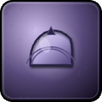
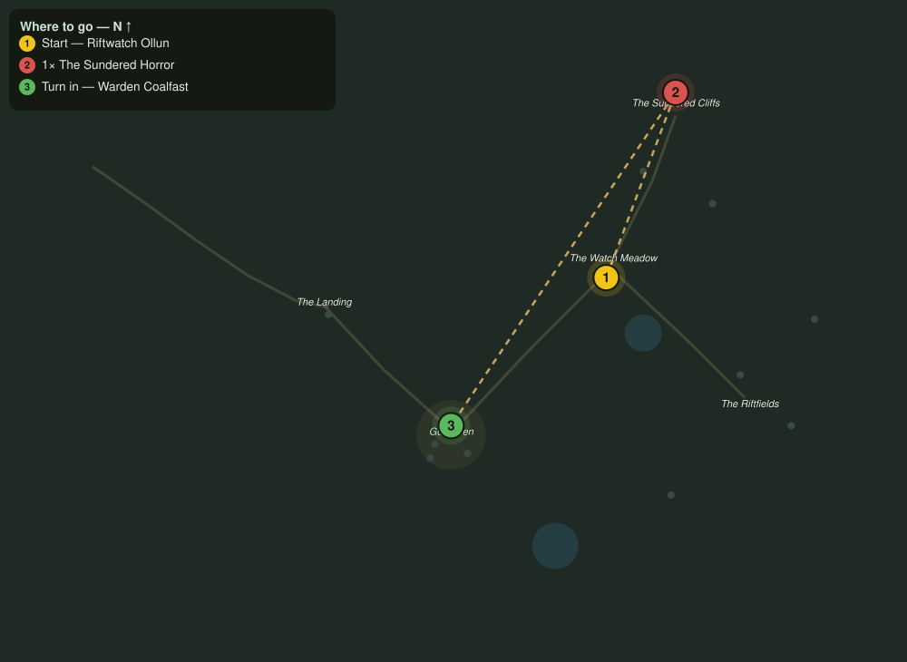

# The Great Break

> Quest ID: `q_fs_the_great_break` · The Farshore

| | |
|---|---|
| **Recommended level** | 6+ |
| **Quest giver** | **Riftwatch Ollun**, Breach Scholar _(at ~x:372, z:2)_ |
| **Turn in to** | **Warden Coalfast**, Redoubt Commander _(at ~x:305, z:66)_ |
| **Requires** | Stalkers off the Light (`q_fs_stalkers_off_the_light`) |
| **Group quest** | 👥 Suggested players: 2 |

## Story

> Every song this island sings ends on the same low note, and it comes from the Sundered Cliffs. Something came through the great break there, <your name>, something the cliffs themselves cracked open to admit, and it is still growing. If it walks north, no bell will matter. Take a friend, take two, and end it. Then tell Coalfast the tune has changed.

## How to complete

- **Kill 1× [The Sundered Horror](bestiary.md#mob-sundered_horror)** (level 7–7, **Elite**)
  - Found in the open world at ~x:402, z:-78 (1 mob, radius 6)
  - _Tracker: The Sundered Horror slain_

Then return to **Warden Coalfast**, Redoubt Commander _(at ~x:305, z:66)_ to turn in.

## Rewards

- **XP:** 1100
- **Money:** 600 copper
- **Item reward (by class):**
  -  🔵 Mantle of the Unbroken Shore — _warrior, mage, rogue_ · 30 armor, +2 Str, +3 Sta

## On completion

> Ollun sent word ahead: the singing stopped. My whole town heard the quiet, $N, and half of them wept at the sound of nothing at all. Wear this mantle. The Farshore does not forget who held its shore.

## Where to go

**[🧭 Open this route in 3D →](#/questroute/q_fs_the_great_break)**

_Numbered route: ① start → objectives → 3 turn in. Faint dots are the rest of the zone for context — see the [full zone map](README.md). Mob names above link to the [bestiary](bestiary.md)._
