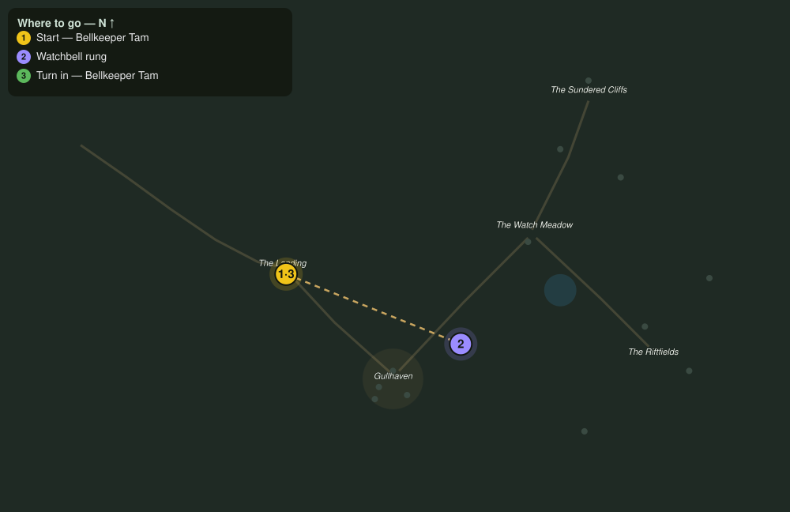

# The Three Bells

> Quest ID: `q_fs_the_three_bells` · The Farshore

| | |
|---|---|
| **Recommended level** | 3+ (zone range 3–7) |
| **Quest giver** | **Bellkeeper Tam**, Watchbell Keeper _(at ~x:252, z:18)_ |
| **Turn in to** | **Bellkeeper Tam**, Watchbell Keeper _(at ~x:252, z:18)_ |
| **Requires** | The Bell at the Landing (`q_fs_bell_at_the_landing`) |

## Story

> Three watchbells stand the coast beyond my own: one on the Landing point, one on the south strand, one out by the Riftfields shore. If a rope has rotted or a clapper has been carried off, the town learns of a break when it is already in the streets. Walk the coast, <your name>, and ring each bell once, so I know it still has a voice.

## How to complete

- **Interact 3× with Coastal Watchbell**
  - Locations: ~x:256, z:0 · ~x:318, z:94 · ~x:442, z:64
  - _Tracker: Watchbell rung_

Then return to **Bellkeeper Tam**, Watchbell Keeper _(at ~x:252, z:18)_ to turn in.

## Rewards

- **XP:** 400
- **Money:** 180 copper

## On completion

> Three voices, three answers, carried clean over the water. Sleep in Gullhaven tonight, $N, and know that if a bell wakes you, it will be by my hand and in good time.

## Where to go

**[🧭 Open this route in 3D →](#/questroute/q_fs_the_three_bells)**

_Numbered route: ① start → objectives → 3 turn in. Faint dots are the rest of the zone for context — see the [full zone map](README.md). Mob names above link to the [bestiary](bestiary.md)._
