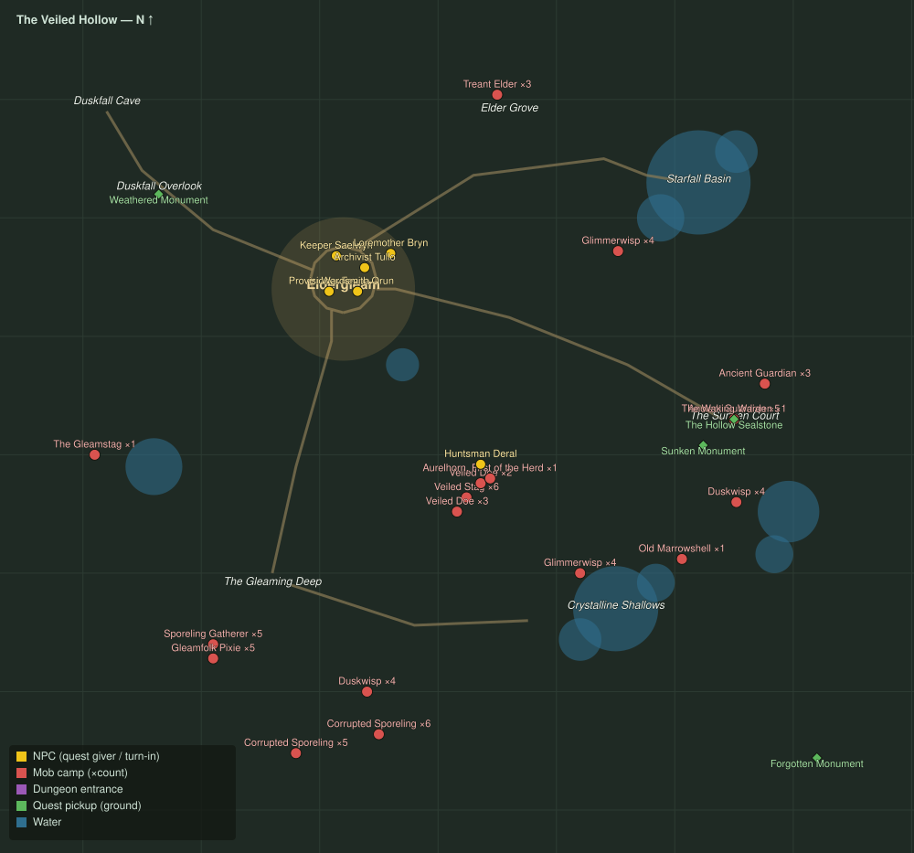

# The Veiled Hollow

Level range: **15–20** · Hub: Eldergleam · 17 quests

_Gold = NPCs · red = mob camps (×count) · purple = dungeon entrances · green = ground pickups · blue = water._

📖 **[Bestiary for this zone](bestiary.md)** — every mob's health, armor, damage, and how to kill it.

| Lvl | Quest | Giver | Type |
|----:|-------|-------|------|
| 14 | [The Thinned Veil](q-veil-thinned.md) | Keeper Saelwyn | collect |
| 14 | [Gleaming Antlers](q-gleaming-antlers.md) | Provisioner Fenna | collect |
| 14 | [Lights of the Shallows](q-wisp-lights.md) | Loremother Bryn | collect |
| 15 | [Calming the Deep](q-calming-the-deep.md) | Keeper Saelwyn | kill |
| 15 | [What the Stones Remember](q-monument-tour.md) | Archivist Tullo | interact |
| 15 | [Menace in the Glade](q-grove-menace.md) | Provisioner Fenna | kill |
| 16 | [Hearts of the Ring](q-spore-hearts.md) | Loremother Bryn | collect |
| 16 | [Shards of Starfall](q-shards-of-starfall.md) | Archivist Tullo | collect |
| 16 | [The Warden of the Herds](q-hollow-the-huntsman.md) | Provisioner Fenna | interact |
| 17 | [The Sunken Court](q-sunken-court.md) | Keeper Saelwyn | kill |
| 17 | [The Treant Accord](q-treant-accord.md) | Loremother Bryn | collect |
| 17 | [Against the Spore Tide](q-spore-tide.md) | Loremother Bryn | kill |
| 17 | [The Old Shell of the Shallows](q-hollow-old-marrowshell.md) 👥 | Huntsman Deral | kill |
| 18 | [The Waking Warden](q-waking-warden.md) 👥 | Keeper Saelwyn | kill |
| 18 | [The Seal Restored](q-seal-restored.md) | Keeper Saelwyn | interact |
| 18 | [Echoes of the Warden](q-wardens-echoes.md) | Archivist Tullo | kill |
| 18 | [First of the Herd](q-hollow-first-of-the-herd.md) 👥 | Huntsman Deral | kill |
