# Bestiary — The Veiled Hollow

13 creatures you'll fight in this zone. Health/armor/damage are shown across the mob's spawn level range (mobs roll a random level within it). Mitigation % is what a same-level attacker's physical hits lose to armor — spells ignore armor.

> Threat tiers: **Boss** (dungeon, group it) · **Elite** (~2.3× HP, ~1.5× damage) · **Rare** (tough roamer) · normal (everything else).

## Common creatures

### Veiled Doe

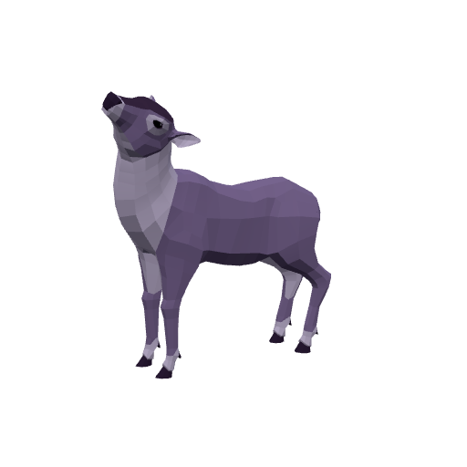

| Stat | Value |
|---|---|
| Level | 14–15 |
| Family | Beast |
| Health | 256–272 HP |
| Armor (physical mitigation) | 130–140 (~8% vs a same-level attacker) |
| Melee damage | 24–40 per hit @ 2.2s swing (~14–15 DPS) |
| Location | The Veiled Hollow · ~x:8, z:1124 · ~x:18, z:1112 — [🗺️ show on map](#/map/8/1124) |

**Best way to kill:**

- Straightforward melee attacker — tank it, heal as needed, and burn it down. No special tricks.

**Loot:**

- Coins: 40 copper (always drops)

### Duskwisp

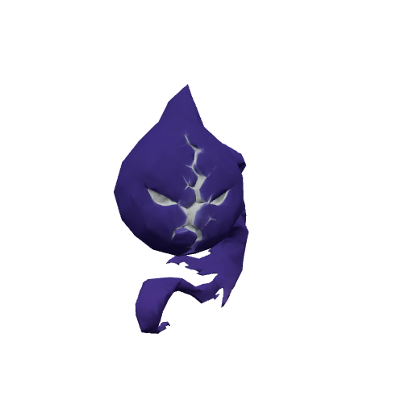

| Stat | Value |
|---|---|
| Level | 15–16 |
| Family | Elemental |
| Health | 318–337 HP |
| Armor (physical mitigation) | 168–180 (~9% vs a same-level attacker) |
| Melee damage | 37–61 per hit @ 1.9s swing (~25–26 DPS) |
| Location | The Veiled Hollow · ~x:126, z:1120 · ~x:-30, z:1200 — [🗺️ show on map](#/map/126/1120) |

**Best way to kill:**

- **Duskchill:** Poison DoT on hit — cleanse it or keep heals ticking.

**Loot:**

- Coins: 70 copper (always drops)

| Item | Type | Drop chance | Notes |
|---|---|---:|---|
| 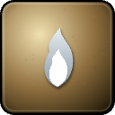  Duskwisp Essence | Quest item | 60% | quest item — only drops while on _The Thinned Veil_ |
|   Starfall Shard | Quest item | 50% | quest item — only drops while on _Shards of Starfall_ |

### Gleamfolk Pixie

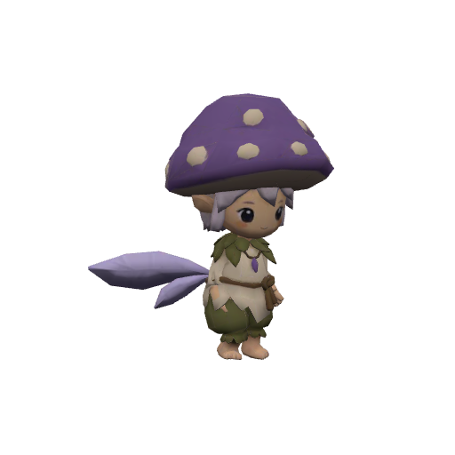

| Stat | Value |
|---|---|
| Level | 15–16 |
| Family | Kobold |
| Health | 288–305 HP |
| Armor (physical mitigation) | 140–150 (~8% vs a same-level attacker) |
| Melee damage | 29–48 per hit @ 2.2s swing (~17–18 DPS) |
| Location | The Veiled Hollow · ~x:-95, z:1186 — [🗺️ show on map](#/map/-95/1186) |

**Best way to kill:**

- Straightforward melee attacker — tank it, heal as needed, and burn it down. No special tricks.

**Loot:**

- Coins: 70 copper (always drops)

### Glimmerwisp

| Stat | Value |
|---|---|
| Level | 15–16 |
| Family | Elemental |
| Health | 268–284 HP |
| Armor (physical mitigation) | 140–150 (~8% vs a same-level attacker) |
| Melee damage | 29–48 per hit @ 2s swing (~19–20 DPS) |
| Location | The Veiled Hollow · ~x:76, z:1014 · ~x:60, z:1150 — [🗺️ show on map](#/map/76/1014) |

**Best way to kill:**

- Straightforward melee attacker — tank it, heal as needed, and burn it down. No special tricks.

**Loot:**

- Coins: 70 copper (always drops)

| Item | Type | Drop chance | Notes |
|---|---|---:|---|
| 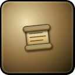  Wisp Mote | Quest item | 60% | quest item — only drops while on _Lights of the Shallows_ |

### Sporeling Gatherer

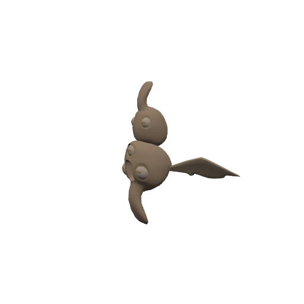

| Stat | Value |
|---|---|
| Level | 15 |
| Family | Kobold |
| Health | 286 HP |
| Armor (physical mitigation) | 140 (~8% vs a same-level attacker) |
| Melee damage | 29–45 per hit @ 2.2s swing (~17 DPS) |
| Location | The Veiled Hollow · ~x:-95, z:1180 — [🗺️ show on map](#/map/-95/1180) |

**Best way to kill:**

- Straightforward melee attacker — tank it, heal as needed, and burn it down. No special tricks.

**Loot:**

- Coins: 65 copper (always drops)

### Veiled Stag

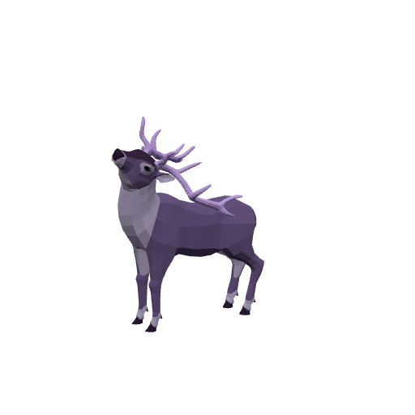

| Stat | Value |
|---|---|
| Level | 15–16 |
| Family | Beast |
| Health | 340–360 HP |
| Armor (physical mitigation) | 168–180 (~9% vs a same-level attacker) |
| Melee damage | 32–53 per hit @ 2.1s swing (~20–21 DPS) |
| Location | The Veiled Hollow · ~x:12, z:1118 — [🗺️ show on map](#/map/12/1118) |

**Best way to kill:**

- Straightforward melee attacker — tank it, heal as needed, and burn it down. No special tricks.

**Loot:**

- Coins: 45 copper (always drops)

| Item | Type | Drop chance | Notes |
|---|---|---:|---|
| 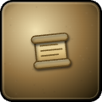  Gleaming Antler | Quest item | 55% | quest item — only drops while on _Gleaming Antlers_ |

### Corrupted Sporeling

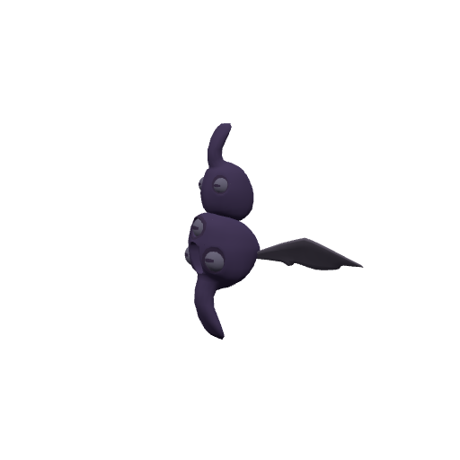

| Stat | Value |
|---|---|
| Level | 16–17 |
| Family | Kobold |
| Health | 375–396 HP |
| Armor (physical mitigation) | 225–240 (~11–12% vs a same-level attacker) |
| Melee damage | 44–72 per hit @ 2s swing (~28–30 DPS) |
| Location | The Veiled Hollow · ~x:-25, z:1218 · ~x:-60, z:1226 — [🗺️ show on map](#/map/-25/1218) |

**Best way to kill:**

- Frenzies nearby kin (faster swings) when one dies — pull them one at a time.

**Loot:**

- Coins: 85 copper (always drops)

| Item | Type | Drop chance | Notes |
|---|---|---:|---|
|   Spore Heart | Quest item | 65% | quest item — only drops while on _Hearts of the Ring_ |

## Elites

### Old Marrowshell — _Elite · Rare_

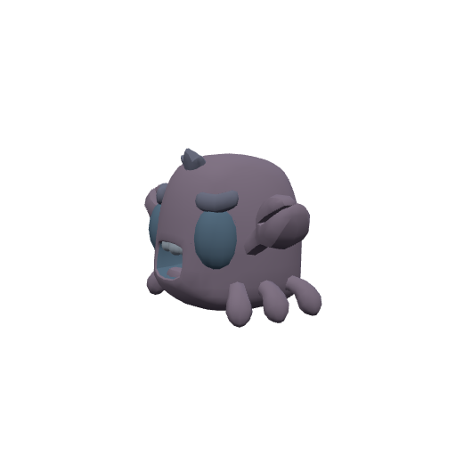

| Stat | Value |
|---|---|
| Level | 17 |
| Family | Beast |
| Health | 2769 HP |
| Armor (physical mitigation) | 544 (~23% vs a same-level attacker) |
| Melee damage | 92–144 per hit @ 2s swing (~59 DPS) |
| Crowd control | Immune |
| Respawn | ~3 min (rare spawn) |
| Location | The Veiled Hollow · ~x:103, z:1144 — [🗺️ show on map](#/map/103/1144) |

**Best way to kill:**

- **Elite** — ~2.3× the health and ~1.5× the damage of a normal mob; bring a group or out-level it.
- Immune to crowd control — it can't be stunned, feared, or polymorphed; just tank and burn.
- **Ancient Carapace:** Periodically hardens against physical hits — time burst between windows or switch to spell damage.
- **Coldwater Rot:** Poison DoT on hit — cleanse it or keep heals ticking.
- Will follow you into the water — no escaping by swimming.

**Loot:**

- Coins: 700 copper (always drops)

| Item | Type | Drop chance | Notes |
|---|---|---:|---|
| 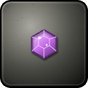  Guardian Core | Junk | 100% | sells for 180c |
|  🟢 Duskfang Dirk | Weapon — Main hand · 13–21 dmg @ 1.7s (~10 DPS), +6 Agi, +2 Sta | 35% |  |

### The Gleamstag — _Elite · Rare_

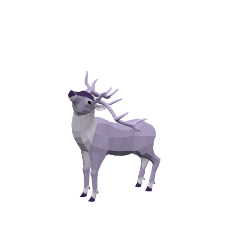

| Stat | Value |
|---|---|
| Level | 17 |
| Family | Beast |
| Health | 2530 HP |
| Armor (physical mitigation) | 352 (~16% vs a same-level attacker) |
| Melee damage | 87–136 per hit @ 1.8s swing (~62 DPS) |
| Respawn | ~3 min (rare spawn) |
| Location | The Veiled Hollow · ~x:-145, z:1100 — [🗺️ show on map](#/map/-145/1100) |

**Best way to kill:**

- **Elite** — ~2.3× the health and ~1.5× the damage of a normal mob; bring a group or out-level it.
- Straightforward melee attacker — tank it, heal as needed, and burn it down. No special tricks.

**Loot:**

- Coins: 260 copper (always drops)

| Item | Type | Drop chance | Notes |
|---|---|---:|---|
|  🔵 Gleamstag Charm | Junk | 100% | sells for 2500c |

### Ancient Guardian — _Elite_

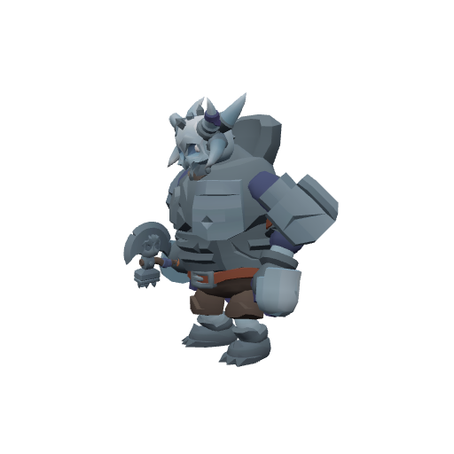

| Stat | Value |
|---|---|
| Level | 18–19 |
| Family | Elemental |
| Health | 1474–1539 HP |
| Armor (physical mitigation) | 510–540 (~21% vs a same-level attacker) |
| Melee damage | 78–128 per hit @ 2.2s swing (~45–48 DPS) |
| Respawn | ~25s |
| Location | The Veiled Hollow · ~x:125, z:1085 · ~x:138, z:1070 — [🗺️ show on map](#/map/125/1085) |

**Best way to kill:**

- **Elite** — ~2.3× the health and ~1.5× the damage of a normal mob; bring a group or out-level it.
- **Stone Bulwark:** Periodically hardens against physical hits — time burst between windows or switch to spell damage.

**Loot:**

- Coins: 170 copper (always drops)

| Item | Type | Drop chance | Notes |
|---|---|---:|---|
|   Guardian Core | Junk | 40% | sells for 180c |

### Aurelhorn, First of the Herd — _Elite · Rare_

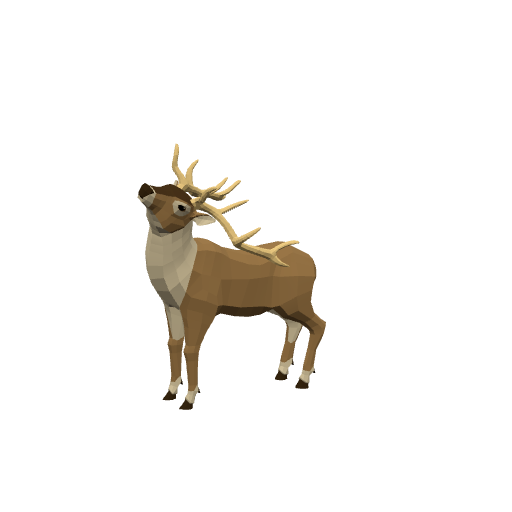

| Stat | Value |
|---|---|
| Level | 18 |
| Family | Beast |
| Health | 3018 HP |
| Armor (physical mitigation) | 442 (~19% vs a same-level attacker) |
| Melee damage | 98–153 per hit @ 1.9s swing (~66 DPS) |
| Crowd control | Immune |
| Respawn | ~3 min (rare spawn) |
| Location | The Veiled Hollow · ~x:22, z:1110 — [🗺️ show on map](#/map/22/1110) |

**Best way to kill:**

- **Elite** — ~2.3× the health and ~1.5× the damage of a normal mob; bring a group or out-level it.
- Immune to crowd control — it can't be stunned, feared, or polymorphed; just tank and burn.
- **Trampling Charge:** Pulses AoE damage around itself — healers expect steady raid damage; don't bring extra mobs into it.
- Enrages at low HP (hits much harder) — save burst/defensives for the execute, or kite while enraged.

**Loot:**

- Coins: 700 copper (always drops)

| Item | Type | Drop chance | Notes |
|---|---|---:|---|
|   Gleaming Antler | Quest item | 100% |  |
|  🟢 Veilsteel Blade | Weapon — Main hand · 20–32 dmg @ 2.4s (~11 DPS), +6 Str, +3 Sta | 35% |  |

### Treant Elder — _Elite_

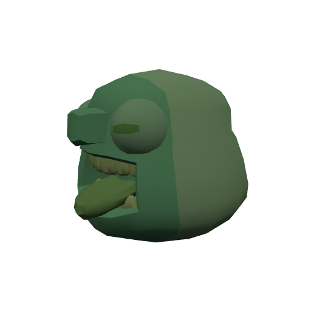

| Stat | Value |
|---|---|
| Level | 18 |
| Family | Ogre |
| Health | 1401 HP |
| Armor (physical mitigation) | 442 (~19% vs a same-level attacker) |
| Melee damage | 78–122 per hit @ 2.4s swing (~42 DPS) |
| Respawn | ~25s |
| Location | The Veiled Hollow · ~x:25, z:948 — [🗺️ show on map](#/map/25/948) |

**Best way to kill:**

- **Elite** — ~2.3× the health and ~1.5× the damage of a normal mob; bring a group or out-level it.
- **Bark Ward:** Shields its allies with absorbs — focus it down before it can ward the pack.

**Loot:**

- Coins: 150 copper (always drops)

| Item | Type | Drop chance | Notes |
|---|---|---:|---|
|   Elder Bark | Quest item | 70% | quest item — only drops while on _The Treant Accord_ |

### The Waking Warden — _Elite_

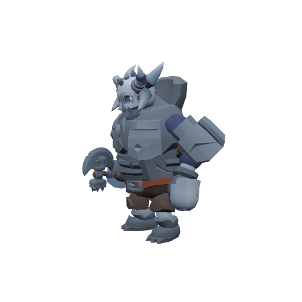

| Stat | Value |
|---|---|
| Level | 20 |
| Family | Elemental |
| Health | 3588 HP |
| Armor (physical mitigation) | 608 (~22% vs a same-level attacker) |
| Melee damage | 113–176 per hit @ 2.1s swing (~69 DPS) |
| Crowd control | Immune |
| Respawn | ~2 min |
| Location | The Veiled Hollow · ~x:125, z:1085 — [🗺️ show on map](#/map/125/1085) |

**Best way to kill:**

- **Elite** — ~2.3× the health and ~1.5× the damage of a normal mob; bring a group or out-level it.
- Immune to crowd control — it can't be stunned, feared, or polymorphed; just tank and burn.
- **Sundering Toll:** Pulses AoE damage around itself — healers expect steady raid damage; don't bring extra mobs into it.
- Enrages at low HP (hits much harder) — save burst/defensives for the execute, or kite while enraged.

**Loot:**

- Coins: 600 copper (always drops)

| Item | Type | Drop chance | Notes |
|---|---|---:|---|
|   The Warden's Seal | Quest item | 100% | quest item — only drops while on _The Waking Warden_ |

---

[← Back to The Veiled Hollow quests](README.md) · [Zone map](map.svg)
