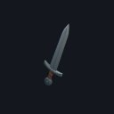
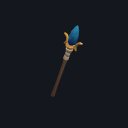
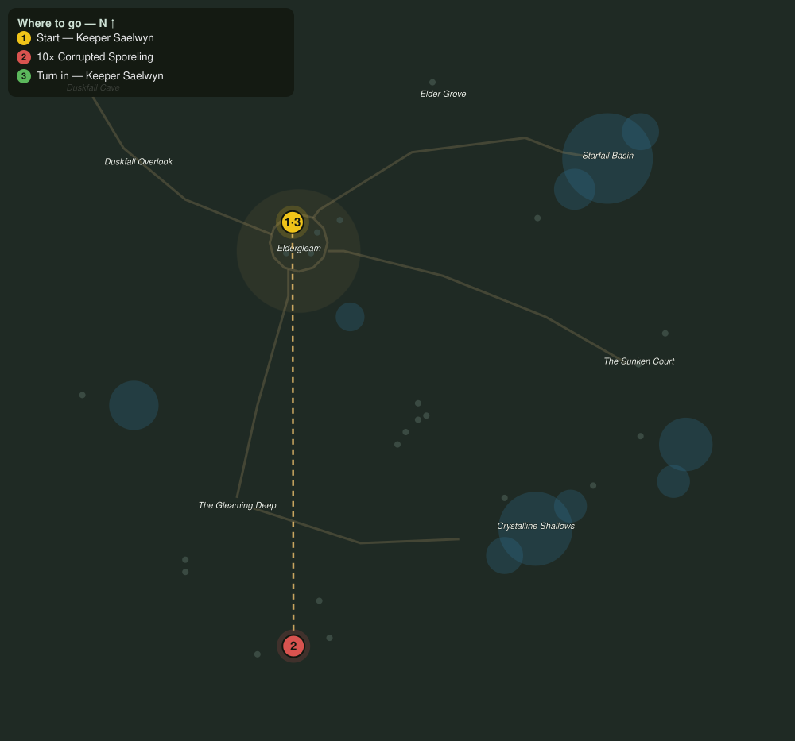

# Calming the Deep

> Quest ID: `q_calming_the_deep` · The Veiled Hollow

| | |
|---|---|
| **Recommended level** | 15+ |
| **Quest giver** | **Keeper Saelwyn**, Keeper of the Hollow _(at ~x:-43, z:1016)_ |
| **Turn in to** | **Keeper Saelwyn**, Keeper of the Hollow _(at ~x:-43, z:1016)_ |
| **Requires** | The Thinned Veil (`q_veil_thinned`) |

## Story

> The sporelings of the Gleaming Deep were gentle folk before the tear touched their rings. What the corruption takes, it does not give back. Grant the corrupted ones rest, <your name>: ten of them, in the north of the Deep.

## How to complete

- **Kill 10× [Corrupted Sporeling](bestiary.md#mob-corrupted_sporeling)** (level 16–17)
  - Found in the open world at ~x:-25, z:1218 (6 mobs, radius 14)
  - Found in the open world at ~x:-60, z:1226 (5 mobs, radius 12)
  - _Tracker: Corrupted Sporeling laid to rest_

Then return to **Keeper Saelwyn**, Keeper of the Hollow _(at ~x:-43, z:1016)_ to turn in.

## Rewards

- **XP:** 4200
- **Money:** 2000 copper
- **Item reward (by class):**
  -  🟢 Veilsteel Blade — _warrior_ · 20–32 dmg @ 2.4s (~11 DPS), +6 Str, +3 Sta
  -  🟢 Duskfang Dirk — _rogue_ · 13–21 dmg @ 1.7s (~10 DPS), +6 Agi, +2 Sta
  -  🟢 Gleamwood Stave — _mage_ · 22–35 dmg @ 2.9s (~10 DPS), +2 Sta, +7 Int

## On completion

> You did what I could not bear to. The gatherers still sing in the south rings; because of you, they will keep singing.

## Leads to

- Hearts of the Ring (`q_spore_hearts`)

## Where to go

**[🧭 Open this route in 3D →](#/questroute/q_calming_the_deep)**

_Numbered route: ① start → objectives → 3 turn in. Faint dots are the rest of the zone for context — see the [full zone map](README.md). Mob names above link to the [bestiary](bestiary.md)._
