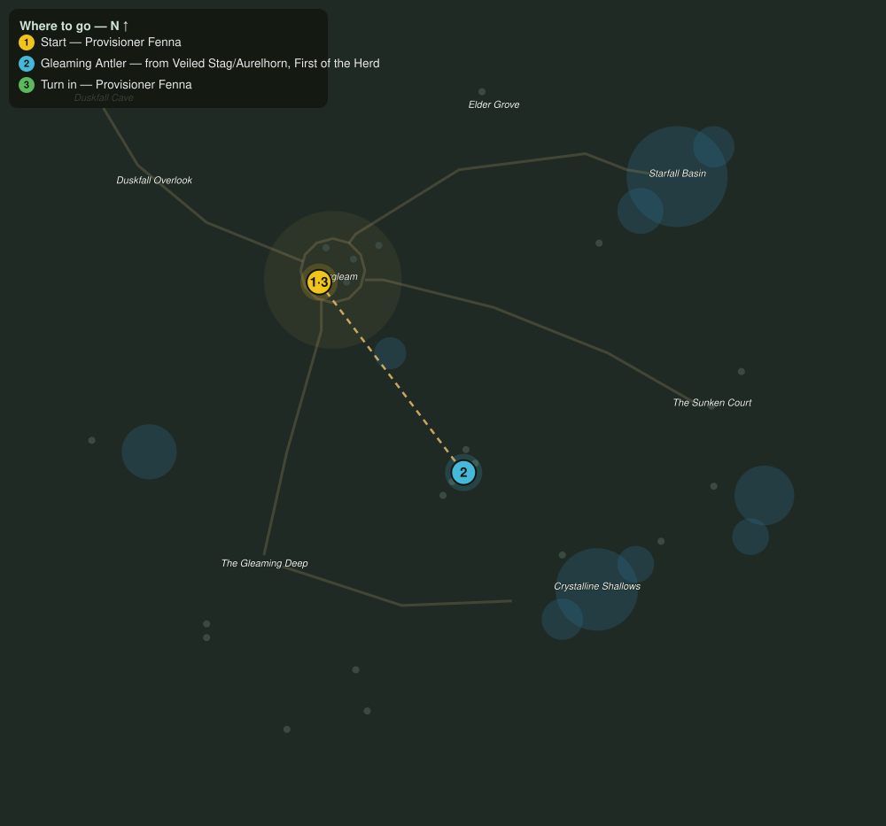

# Gleaming Antlers

> Quest ID: `q_gleaming_antlers` · The Veiled Hollow

| | |
|---|---|
| **Recommended level** | 14+ |
| **Quest giver** | **Provisioner Fenna**, Eldergleam Provisioner _(at ~x:-46, z:1031)_ |
| **Turn in to** | **Provisioner Fenna**, Eldergleam Provisioner _(at ~x:-46, z:1031)_ |

## Story

> The veiled stags shed light where they graze, and their cast antlers hold it for years. Five of them, from the herds in the open glade at the heart of the valley, and my lanterns burn through the winter without oil. The stags need not be harmed, but they do not part with them easily.

## How to complete

- **Collect 5× Gleaming Antler**
  - Drops from [**Veiled Stag**](bestiary.md#mob-veiled_stag) (55% chance) — Found in the open world at ~x:12, z:1118 (6 mobs, radius 16)
  - Drops from [**Aurelhorn, First of the Herd**](bestiary.md#mob-aurelhorn) (100% chance) — Found in the open world at ~x:22, z:1110 (1 mob, radius 6)
  - _Tracker: Gleaming Antler_

Then return to **Provisioner Fenna**, Eldergleam Provisioner _(at ~x:-46, z:1031)_ to turn in.

## Rewards

- **XP:** 3400
- **Money:** 1500 copper

## On completion

> Look how they hold the light! No flame, no smoke, just the glow. The Hollow provides.

## Where to go

**[🧭 Open this route in 3D →](#/questroute/q_gleaming_antlers)**

_Numbered route: ① start → objectives → 3 turn in. Faint dots are the rest of the zone for context — see the [full zone map](README.md). Mob names above link to the [bestiary](bestiary.md)._
