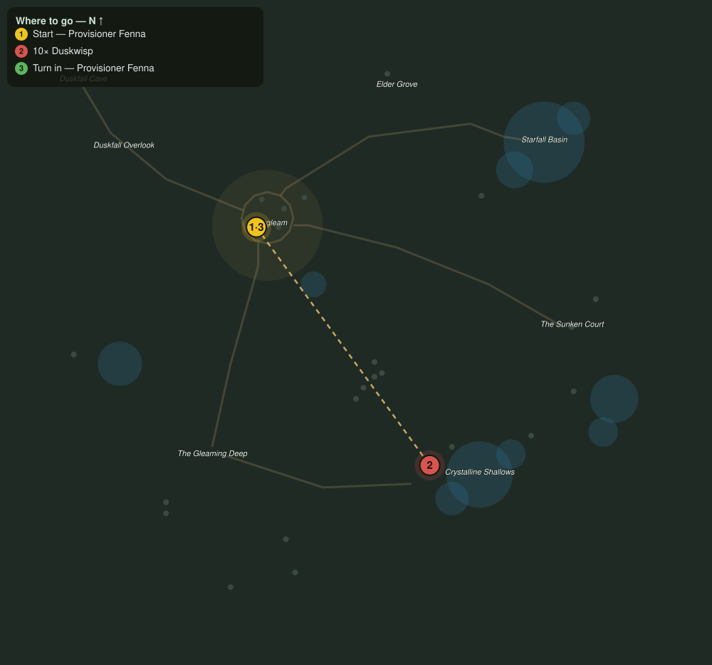

# Menace in the Glade

> Quest ID: `q_grove_menace` · The Veiled Hollow

| | |
|---|---|
| **Recommended level** | 15+ |
| **Quest giver** | **Provisioner Fenna**, Eldergleam Provisioner _(at ~x:-46, z:1031)_ |
| **Turn in to** | **Provisioner Fenna**, Eldergleam Provisioner _(at ~x:-46, z:1031)_ |
| **Requires** | The Thinned Veil (`q_veil_thinned`) |

## Story

> Duskwisps have started drifting in among my stalls after dark, <your name>, and their chill spoils everything it touches. Thin them out for me: ten of them, wherever the veil has torn.

## How to complete

- **Kill 10× [Duskwisp](bestiary.md#mob-duskwisp)** (level 15–16)
  - Found in the open world at ~x:126, z:1120 (4 mobs, radius 12)
  - Found in the open world at ~x:-30, z:1200 (4 mobs, radius 14)
  - _Tracker: Duskwisp dispersed_

Then return to **Provisioner Fenna**, Eldergleam Provisioner _(at ~x:-46, z:1031)_ to turn in.

## Rewards

- **XP:** 4000
- **Money:** 1900 copper

## On completion

> The night market can open again. You have a customer for life, or at least a discount.

## Where to go

**[🧭 Open this route in 3D →](#/questroute/q_grove_menace)**

_Numbered route: ① start → objectives → 3 turn in. Faint dots are the rest of the zone for context — see the [full zone map](README.md). Mob names above link to the [bestiary](bestiary.md)._
