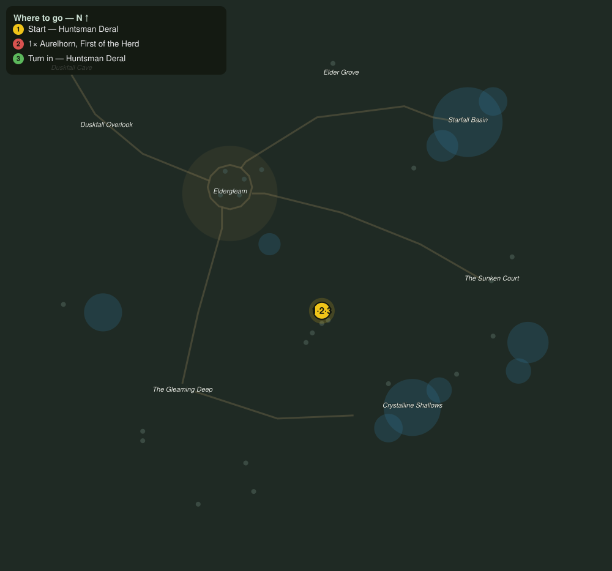

# First of the Herd

> Quest ID: `q_hollow_first_of_the_herd` · The Veiled Hollow

| | |
|---|---|
| **Recommended level** | 18+ |
| **Quest giver** | **Huntsman Deral**, Warden of the Herds _(at ~x:18, z:1104)_ |
| **Turn in to** | **Huntsman Deral**, Warden of the Herds _(at ~x:18, z:1104)_ |
| **Requires** | The Old Shell of the Shallows (`q_hollow_old_marrowshell`) |
| **Group quest** | 👥 Suggested players: 2 |

## Story

> The second name is harder to say. Aurelhorn led these herds when my grandmother kept this lookout, and whatever woke in the Hollow woke him wrong. He tramples what he once warded, and the herd will not survive his madness. He roams the meadows near the old court roads. End him with mercy, <your name>, and bring a friend to share the weight of it.

## How to complete

- **Kill 1× [Aurelhorn, First of the Herd](bestiary.md#mob-aurelhorn)** (level 18–18, **Elite**, Rare)
  - Found in the open world at ~x:22, z:1110 (1 mob, radius 6)
  - _Tracker: Aurelhorn given peace_

Then return to **Huntsman Deral**, Warden of the Herds _(at ~x:18, z:1104)_ to turn in.

## Rewards

- **XP:** 6000
- **Money:** 3400 copper

## On completion

> So the First falls to the last. The herd is already calmer, do you feel it? You did the Hollow a kindness today, even if it does not look like one.

## Where to go

**[🧭 Open this route in 3D →](#/questroute/q_hollow_first_of_the_herd)**

_Numbered route: ① start → objectives → 3 turn in. Faint dots are the rest of the zone for context — see the [full zone map](README.md). Mob names above link to the [bestiary](bestiary.md)._
