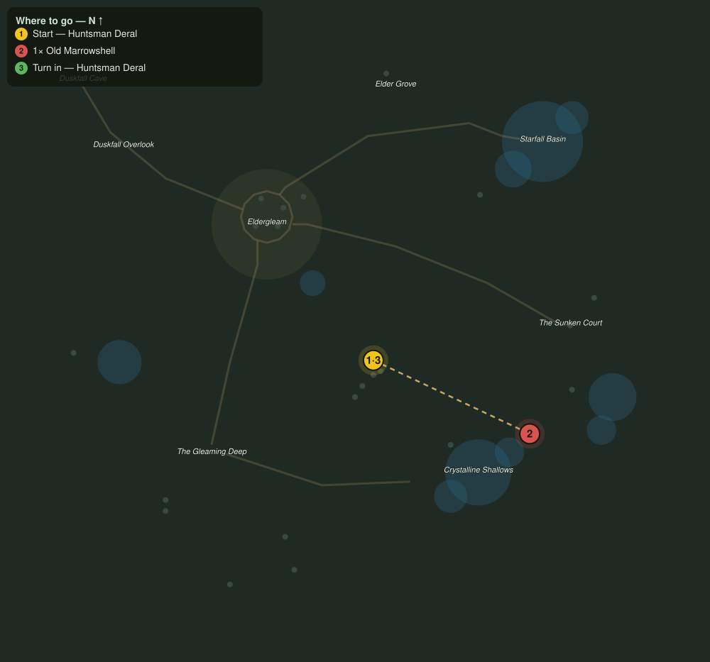

# The Old Shell of the Shallows

> Quest ID: `q_hollow_old_marrowshell` · The Veiled Hollow

| | |
|---|---|
| **Recommended level** | 17+ |
| **Quest giver** | **Huntsman Deral**, Warden of the Herds _(at ~x:18, z:1104)_ |
| **Turn in to** | **Huntsman Deral**, Warden of the Herds _(at ~x:18, z:1104)_ |
| **Requires** | The Warden of the Herds (`q_hollow_the_huntsman`) |
| **Group quest** | 👥 Suggested players: 2 |

## Story

> The first name is Old Marrowshell, a crab the size of a cart that has hunted the eastern shallows since before Eldergleam had a gate. It wanders, <your name>, so you will have to walk the shoreline until you cross its track. Do not go alone, and do not trust its stillness.

## How to complete

- **Kill 1× [Old Marrowshell](bestiary.md#mob-old_marrowshell)** (level 17–17, **Elite**, Rare)
  - Found in the open world at ~x:103, z:1144 (1 mob, radius 5)
  - _Tracker: Old Marrowshell slain_

Then return to **Huntsman Deral**, Warden of the Herds _(at ~x:18, z:1104)_ to turn in.

## Rewards

- **XP:** 5600
- **Money:** 3000 copper

## On completion

> The shallows are just water again. I have watched that shell break better hunters than me, $N. Not you.

## Leads to

- First of the Herd (`q_hollow_first_of_the_herd`)

## Where to go

**[🧭 Open this route in 3D →](#/questroute/q_hollow_old_marrowshell)**

_Numbered route: ① start → objectives → 3 turn in. Faint dots are the rest of the zone for context — see the [full zone map](README.md). Mob names above link to the [bestiary](bestiary.md)._
