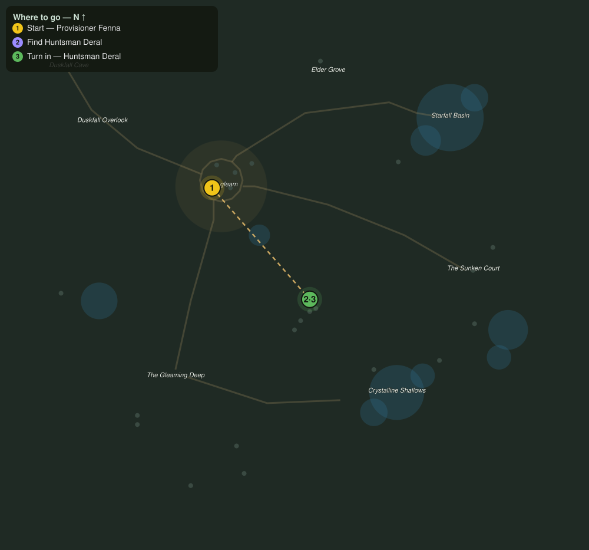

# The Warden of the Herds

> Quest ID: `q_hollow_the_huntsman` · The Veiled Hollow

| | |
|---|---|
| **Recommended level** | 16+ |
| **Quest giver** | **Provisioner Fenna**, Eldergleam Provisioner _(at ~x:-46, z:1031)_ |
| **Turn in to** | **Huntsman Deral**, Warden of the Herds _(at ~x:18, z:1104)_ |

## Story

> You look like someone who can handle more than wisps, <your name>. Huntsman Deral keeps his lookout among the stag meadows east of here, and he has been asking after capable hands for weeks. Whatever he is tracking out there, he will not say it aloud in the village.

## How to complete

- **Interact with **Huntsman Deral**, Warden of the Herds _(at ~x:18, z:1104)_**
  - _Tracker: Find Huntsman Deral_

Then return to **Huntsman Deral**, Warden of the Herds _(at ~x:18, z:1104)_ to turn in.

## Rewards

- **XP:** 2400
- **Money:** 900 copper

## On completion

> Fenna sent you? Good. Then she trusts you, and I have two names that need crossing out.

## Leads to

- The Old Shell of the Shallows (`q_hollow_old_marrowshell`)

## Where to go

**[🧭 Open this route in 3D →](#/questroute/q_hollow_the_huntsman)**

_Numbered route: ① start → objectives → 3 turn in. Faint dots are the rest of the zone for context — see the [full zone map](README.md). Mob names above link to the [bestiary](bestiary.md)._
