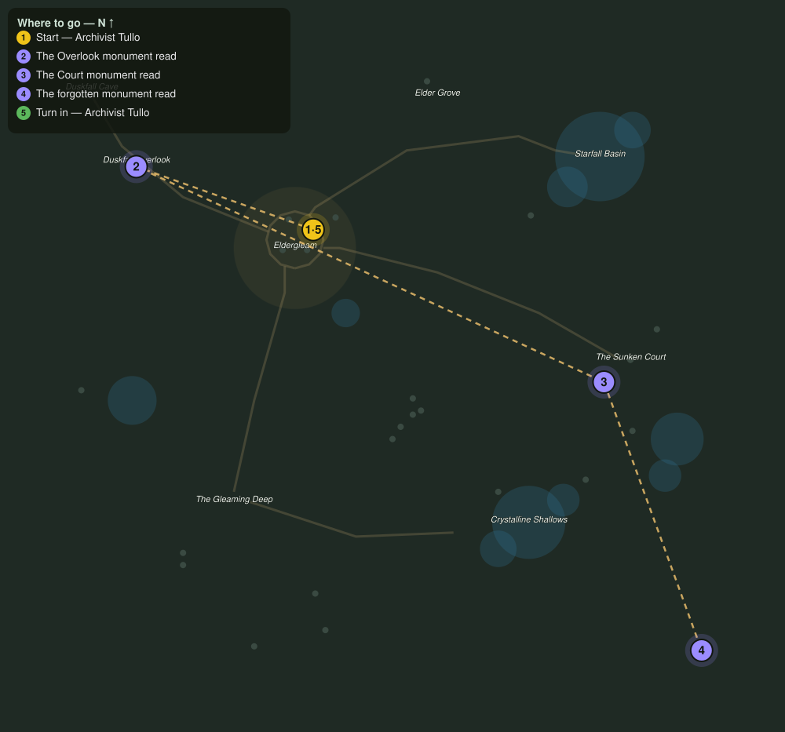

# What the Stones Remember

> Quest ID: `q_monument_tour` · The Veiled Hollow

| | |
|---|---|
| **Recommended level** | 15+ |
| **Quest giver** | **Archivist Tullo**, Reader of Stones _(at ~x:-31, z:1021)_ |
| **Turn in to** | **Archivist Tullo**, Reader of Stones _(at ~x:-31, z:1021)_ |

## Story

> Three monuments still stand from before the sealing: one at the Duskfall Overlook, one in the Sunken Court, and one lost in the far northeast where nobody walks. Read them for me, <your name>. My knees gave out two centuries of stairs ago.

## How to complete

- **Interact with Weathered Monument**
  - Locations: ~x:-118, z:990
  - _Tracker: The Overlook monument read_
- **Interact with Sunken Monument**
  - Locations: ~x:112, z:1096
  - _Tracker: The Court monument read_
- **Interact with Forgotten Monument**
  - Locations: ~x:160, z:1228
  - _Tracker: The forgotten monument read_

Then return to **Archivist Tullo**, Reader of Stones _(at ~x:-31, z:1021)_ to turn in.

## Rewards

- **XP:** 4200
- **Money:** 2000 copper

## On completion

> An overlook, a court, and a forgotten corner... and all three verses of the sealing song, together for the first time since it was sung. You have made an old reader very happy.

## Leads to

- Shards of Starfall (`q_shards_of_starfall`)

## Where to go

**[🧭 Open this route in 3D →](#/questroute/q_monument_tour)**

_Numbered route: ① start → objectives → 5 turn in. Faint dots are the rest of the zone for context — see the [full zone map](README.md). Mob names above link to the [bestiary](bestiary.md)._
