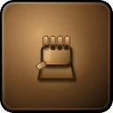
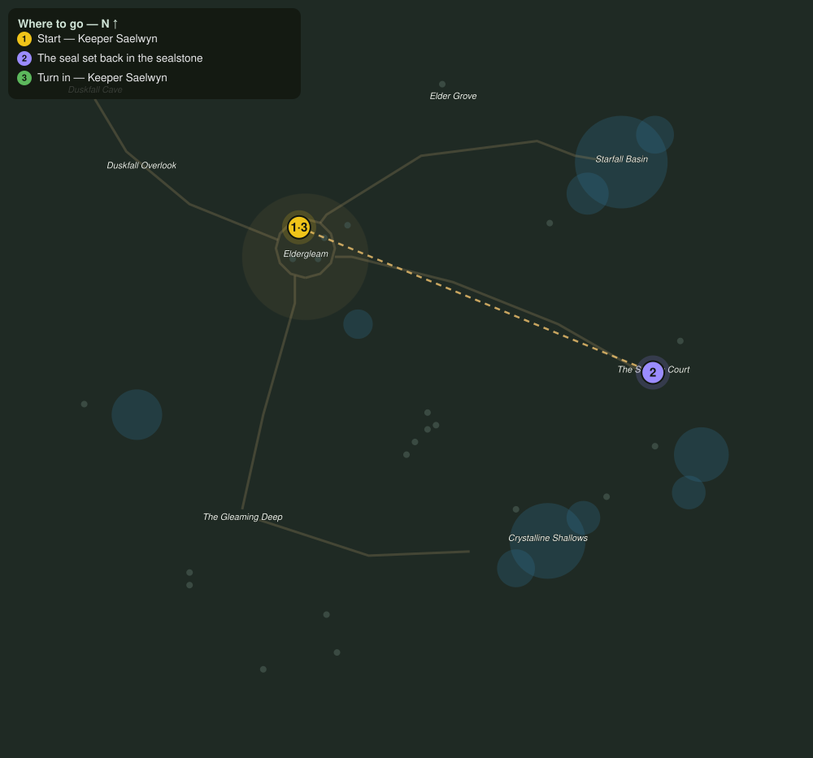

# The Seal Restored

> Quest ID: `q_seal_restored` · The Veiled Hollow

| | |
|---|---|
| **Recommended level** | 18+ |
| **Quest giver** | **Keeper Saelwyn**, Keeper of the Hollow _(at ~x:-43, z:1016)_ |
| **Turn in to** | **Keeper Saelwyn**, Keeper of the Hollow _(at ~x:-43, z:1016)_ |
| **Requires** | The Waking Warden (`q_waking_warden`) |

## Story

> Take the Warden's seal to the sealstone at the heart of the court and set it back where it was struck loose. Then the Hollow can begin to heal, and you, <your name>, will have done what no one of your kind has done before.

## How to complete

- **Interact with The Hollow Sealstone**
  - Locations: ~x:125, z:1085
  - _Tracker: The seal set back in the sealstone_

Then return to **Keeper Saelwyn**, Keeper of the Hollow _(at ~x:-43, z:1016)_ to turn in.

## Rewards

- **XP:** 7400
- **Money:** 5500 copper
- **Item reward (by class):**
  -  🔵 Warden's Oathband — _warrior, rogue, mage_ · 40 armor, +5 Sta, +4 Spi

## On completion

> I felt it close from here, gentle as dusk. The Hollow remembers its friends, $N. However far you travel, there will always be a light for you beneath the great tree.

## Where to go

**[🧭 Open this route in 3D →](#/questroute/q_seal_restored)**

_Numbered route: ① start → objectives → 3 turn in. Faint dots are the rest of the zone for context — see the [full zone map](README.md). Mob names above link to the [bestiary](bestiary.md)._
